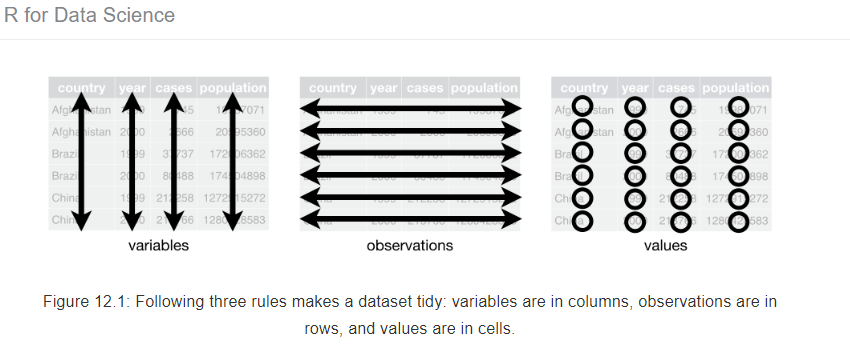
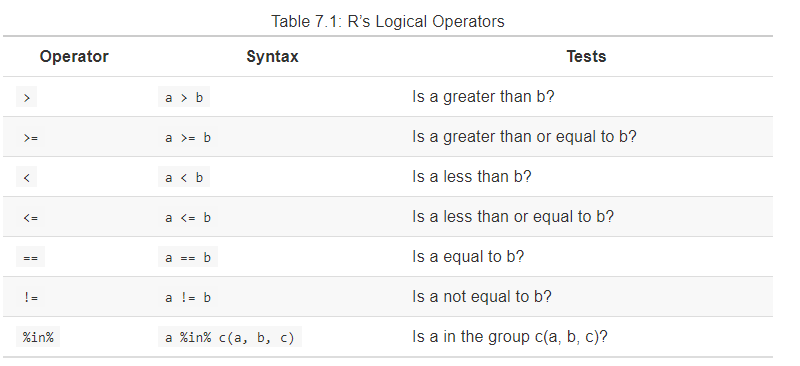
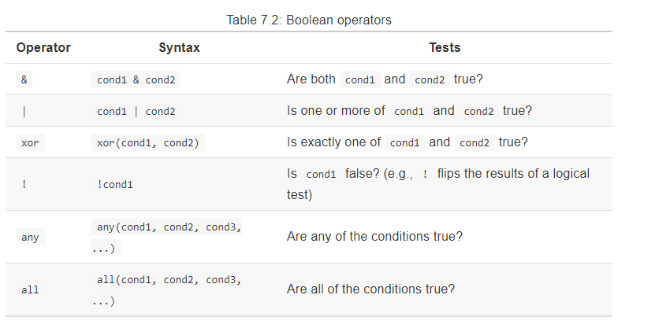

R Training: Intermediate
========================================================
author: 
date: 2019-09-17
width: 1440
height: 900
<style>
body {
    overflow: scroll;
}
</style>

Agenda
========================================================

- Introduction 
- Data Wrangling
- Break
- Visualization

Follow along in R by running what is in the code block  
## Please ask questions as we go!
***
  
Please install packages to start: 

```r
install.packages("tidyverse")
install.packages("nycflights13")  
```


```r
library(tidyverse)
library(nycflights13)
```

Introduction
=======================================================
-  Recap basics
-  Logistics
-  Workflow
-  Import
-  Explore

Recap Basics
=======================================================
-  Understand what R is and what is used for
-  Able to navigate around and use RStudio
-  Understand the main data types and ways data are organized
  - Double, Integer, Character, Logical
  - Vector, Matrix, Lists, Data frames
-  Understand how to use functions and packages
-  Able to import data into the environment
-  Start a project and why you would want to organize work this way

Logistics
========================================================

```r
sessioninfo::platform_info()
```

```
 setting  value                       
 version  R version 3.6.1 (2019-07-05)
 os       Windows 10 x64              
 system   x86_64, mingw32             
 ui       RTerm                       
 language (EN)                        
 collate  English_United States.1252  
 ctype    English_United States.1252  
 tz       America/New_York            
 date     2019-09-16                  
```

Logistics
========================================================

```r
package <- sessioninfo::package_info(pkgs = c("dplyr", "tidyr", "nycflights13", "ggplot2") , dependencies = FALSE)
```
<div style="border: 1px solid #ddd; padding: 5px; overflow-x: scroll; width:100%; "><table>
 <thead>
  <tr>
   <th style="text-align:left;">   </th>
   <th style="text-align:left;"> package </th>
   <th style="text-align:left;"> ondiskversion </th>
   <th style="text-align:left;"> loadedversion </th>
   <th style="text-align:left;"> path </th>
   <th style="text-align:left;"> loadedpath </th>
   <th style="text-align:left;"> attached </th>
   <th style="text-align:left;"> is_base </th>
   <th style="text-align:left;"> date </th>
   <th style="text-align:left;"> source </th>
   <th style="text-align:left;"> md5ok </th>
   <th style="text-align:left;"> library </th>
  </tr>
 </thead>
<tbody>
  <tr>
   <td style="text-align:left;"> dplyr </td>
   <td style="text-align:left;"> dplyr </td>
   <td style="text-align:left;"> 0.8.3 </td>
   <td style="text-align:left;"> 0.8.3 </td>
   <td style="text-align:left;"> C:/Users/e0041093/Documents/R/win-library/3.6/dplyr </td>
   <td style="text-align:left;"> C:/Users/e0041093/Documents/R/win-library/3.6/dplyr </td>
   <td style="text-align:left;"> TRUE </td>
   <td style="text-align:left;"> FALSE </td>
   <td style="text-align:left;"> 2019-07-04 </td>
   <td style="text-align:left;"> CRAN (R 3.6.1) </td>
   <td style="text-align:left;"> TRUE </td>
   <td style="text-align:left;"> C:/Users/e0041093/Documents/R/win-library/3.6 </td>
  </tr>
  <tr>
   <td style="text-align:left;"> ggplot2 </td>
   <td style="text-align:left;"> ggplot2 </td>
   <td style="text-align:left;"> 3.2.1 </td>
   <td style="text-align:left;"> 3.2.1 </td>
   <td style="text-align:left;"> C:/Users/e0041093/Documents/R/win-library/3.6/ggplot2 </td>
   <td style="text-align:left;"> C:/Users/e0041093/Documents/R/win-library/3.6/ggplot2 </td>
   <td style="text-align:left;"> TRUE </td>
   <td style="text-align:left;"> FALSE </td>
   <td style="text-align:left;"> 2019-08-10 </td>
   <td style="text-align:left;"> CRAN (R 3.6.1) </td>
   <td style="text-align:left;"> TRUE </td>
   <td style="text-align:left;"> C:/Users/e0041093/Documents/R/win-library/3.6 </td>
  </tr>
  <tr>
   <td style="text-align:left;"> nycflights13 </td>
   <td style="text-align:left;"> nycflights13 </td>
   <td style="text-align:left;"> 1.0.0 </td>
   <td style="text-align:left;"> 1.0.0 </td>
   <td style="text-align:left;"> C:/Users/e0041093/Documents/R/win-library/3.6/nycflights13 </td>
   <td style="text-align:left;"> C:/Users/e0041093/Documents/R/win-library/3.6/nycflights13 </td>
   <td style="text-align:left;"> TRUE </td>
   <td style="text-align:left;"> FALSE </td>
   <td style="text-align:left;"> 2018-06-26 </td>
   <td style="text-align:left;"> CRAN (R 3.6.1) </td>
   <td style="text-align:left;"> TRUE </td>
   <td style="text-align:left;"> C:/Users/e0041093/Documents/R/win-library/3.6 </td>
  </tr>
  <tr>
   <td style="text-align:left;"> tidyr </td>
   <td style="text-align:left;"> tidyr </td>
   <td style="text-align:left;"> 0.8.3 </td>
   <td style="text-align:left;"> 0.8.3 </td>
   <td style="text-align:left;"> C:/Users/e0041093/Documents/R/win-library/3.6/tidyr </td>
   <td style="text-align:left;"> C:/Users/e0041093/Documents/R/win-library/3.6/tidyr </td>
   <td style="text-align:left;"> TRUE </td>
   <td style="text-align:left;"> FALSE </td>
   <td style="text-align:left;"> 2019-03-01 </td>
   <td style="text-align:left;"> CRAN (R 3.6.1) </td>
   <td style="text-align:left;"> TRUE </td>
   <td style="text-align:left;"> C:/Users/e0041093/Documents/R/win-library/3.6 </td>
  </tr>
</tbody>
</table></div>

Workflow
========================================================
- Import 
- **Explore data**
- **Wrangle**
- **Visualize**
- Model
- Communicate

Import
========================================================
- Import csv with readr::read_csv
- Import excel with readxl::read_excel
- Import sas with haven::read_sas
- Connect to db with odbc/jdbc connectors
  - obdc with odbc package and connection pane (windows)
  - jdbc with RJDBC package (server)
  - DBI::dbGetQuery(connection_name, "SQL CODE")

Import
========================================================
- From a package:

```r
View(flights)
```
<div style="border: 1px solid #ddd; padding: 5px; overflow-x: scroll; width:100%; "><table>
 <thead>
  <tr>
   <th style="text-align:right;"> year </th>
   <th style="text-align:right;"> month </th>
   <th style="text-align:right;"> day </th>
   <th style="text-align:right;"> dep_time </th>
   <th style="text-align:right;"> sched_dep_time </th>
   <th style="text-align:right;"> dep_delay </th>
   <th style="text-align:right;"> arr_time </th>
   <th style="text-align:right;"> sched_arr_time </th>
   <th style="text-align:right;"> arr_delay </th>
   <th style="text-align:left;"> carrier </th>
   <th style="text-align:right;"> flight </th>
   <th style="text-align:left;"> tailnum </th>
   <th style="text-align:left;"> origin </th>
   <th style="text-align:left;"> dest </th>
   <th style="text-align:right;"> air_time </th>
   <th style="text-align:right;"> distance </th>
   <th style="text-align:right;"> hour </th>
   <th style="text-align:right;"> minute </th>
   <th style="text-align:left;"> time_hour </th>
  </tr>
 </thead>
<tbody>
  <tr>
   <td style="text-align:right;"> 2013 </td>
   <td style="text-align:right;"> 1 </td>
   <td style="text-align:right;"> 1 </td>
   <td style="text-align:right;"> 517 </td>
   <td style="text-align:right;"> 515 </td>
   <td style="text-align:right;"> 2 </td>
   <td style="text-align:right;"> 830 </td>
   <td style="text-align:right;"> 819 </td>
   <td style="text-align:right;"> 11 </td>
   <td style="text-align:left;"> UA </td>
   <td style="text-align:right;"> 1545 </td>
   <td style="text-align:left;"> N14228 </td>
   <td style="text-align:left;"> EWR </td>
   <td style="text-align:left;"> IAH </td>
   <td style="text-align:right;"> 227 </td>
   <td style="text-align:right;"> 1400 </td>
   <td style="text-align:right;"> 5 </td>
   <td style="text-align:right;"> 15 </td>
   <td style="text-align:left;"> 2013-01-01 05:00:00 </td>
  </tr>
  <tr>
   <td style="text-align:right;"> 2013 </td>
   <td style="text-align:right;"> 1 </td>
   <td style="text-align:right;"> 1 </td>
   <td style="text-align:right;"> 533 </td>
   <td style="text-align:right;"> 529 </td>
   <td style="text-align:right;"> 4 </td>
   <td style="text-align:right;"> 850 </td>
   <td style="text-align:right;"> 830 </td>
   <td style="text-align:right;"> 20 </td>
   <td style="text-align:left;"> UA </td>
   <td style="text-align:right;"> 1714 </td>
   <td style="text-align:left;"> N24211 </td>
   <td style="text-align:left;"> LGA </td>
   <td style="text-align:left;"> IAH </td>
   <td style="text-align:right;"> 227 </td>
   <td style="text-align:right;"> 1416 </td>
   <td style="text-align:right;"> 5 </td>
   <td style="text-align:right;"> 29 </td>
   <td style="text-align:left;"> 2013-01-01 05:00:00 </td>
  </tr>
  <tr>
   <td style="text-align:right;"> 2013 </td>
   <td style="text-align:right;"> 1 </td>
   <td style="text-align:right;"> 1 </td>
   <td style="text-align:right;"> 542 </td>
   <td style="text-align:right;"> 540 </td>
   <td style="text-align:right;"> 2 </td>
   <td style="text-align:right;"> 923 </td>
   <td style="text-align:right;"> 850 </td>
   <td style="text-align:right;"> 33 </td>
   <td style="text-align:left;"> AA </td>
   <td style="text-align:right;"> 1141 </td>
   <td style="text-align:left;"> N619AA </td>
   <td style="text-align:left;"> JFK </td>
   <td style="text-align:left;"> MIA </td>
   <td style="text-align:right;"> 160 </td>
   <td style="text-align:right;"> 1089 </td>
   <td style="text-align:right;"> 5 </td>
   <td style="text-align:right;"> 40 </td>
   <td style="text-align:left;"> 2013-01-01 05:00:00 </td>
  </tr>
  <tr>
   <td style="text-align:right;"> 2013 </td>
   <td style="text-align:right;"> 1 </td>
   <td style="text-align:right;"> 1 </td>
   <td style="text-align:right;"> 544 </td>
   <td style="text-align:right;"> 545 </td>
   <td style="text-align:right;"> -1 </td>
   <td style="text-align:right;"> 1004 </td>
   <td style="text-align:right;"> 1022 </td>
   <td style="text-align:right;"> -18 </td>
   <td style="text-align:left;"> B6 </td>
   <td style="text-align:right;"> 725 </td>
   <td style="text-align:left;"> N804JB </td>
   <td style="text-align:left;"> JFK </td>
   <td style="text-align:left;"> BQN </td>
   <td style="text-align:right;"> 183 </td>
   <td style="text-align:right;"> 1576 </td>
   <td style="text-align:right;"> 5 </td>
   <td style="text-align:right;"> 45 </td>
   <td style="text-align:left;"> 2013-01-01 05:00:00 </td>
  </tr>
  <tr>
   <td style="text-align:right;"> 2013 </td>
   <td style="text-align:right;"> 1 </td>
   <td style="text-align:right;"> 1 </td>
   <td style="text-align:right;"> 554 </td>
   <td style="text-align:right;"> 600 </td>
   <td style="text-align:right;"> -6 </td>
   <td style="text-align:right;"> 812 </td>
   <td style="text-align:right;"> 837 </td>
   <td style="text-align:right;"> -25 </td>
   <td style="text-align:left;"> DL </td>
   <td style="text-align:right;"> 461 </td>
   <td style="text-align:left;"> N668DN </td>
   <td style="text-align:left;"> LGA </td>
   <td style="text-align:left;"> ATL </td>
   <td style="text-align:right;"> 116 </td>
   <td style="text-align:right;"> 762 </td>
   <td style="text-align:right;"> 6 </td>
   <td style="text-align:right;"> 0 </td>
   <td style="text-align:left;"> 2013-01-01 06:00:00 </td>
  </tr>
  <tr>
   <td style="text-align:right;"> 2013 </td>
   <td style="text-align:right;"> 1 </td>
   <td style="text-align:right;"> 1 </td>
   <td style="text-align:right;"> 554 </td>
   <td style="text-align:right;"> 558 </td>
   <td style="text-align:right;"> -4 </td>
   <td style="text-align:right;"> 740 </td>
   <td style="text-align:right;"> 728 </td>
   <td style="text-align:right;"> 12 </td>
   <td style="text-align:left;"> UA </td>
   <td style="text-align:right;"> 1696 </td>
   <td style="text-align:left;"> N39463 </td>
   <td style="text-align:left;"> EWR </td>
   <td style="text-align:left;"> ORD </td>
   <td style="text-align:right;"> 150 </td>
   <td style="text-align:right;"> 719 </td>
   <td style="text-align:right;"> 5 </td>
   <td style="text-align:right;"> 58 </td>
   <td style="text-align:left;"> 2013-01-01 05:00:00 </td>
  </tr>
</tbody>
</table></div>


Explore
========================================================
- Simply click on df in Environment to preview, same as View(df)
- names(df) for column names
- head(df) for top 6 rows
- glimpse(df) for columns, data types and sample
- summary(df) for summary statistics
  - Min, Quartiles, mean, # of NAs


  
Data Wrangling 
========================================================

- Background and basics 
- Data Wrangling Part 1: Subset
- Data Wrangling Part 2: Make new variables
- Data Wrangling Part 3: Combine data sets
- Data Wrangling Part 4: Summarizing

Data Wrangling 
========================================================

- **Background and basics** 
- Data Wrangling Part 1: Subset
- Data Wrangling Part 2: Make new variables
- Data Wrangling Part 3: Combine data sets
- Data Wrangling Part 4: Summarizing

tidyverse
========================================================
-  tidyverse is a set of packages developed to optimize R's vectorized operations  
-  requires "tidy data"
  -  each variable is a column
  -  each observations is a row
  -  unique values are in cells  
  
source: https://r4ds.had.co.nz/tidy-data.html#fig:tidy-structure


dplyr basics
========================================================
- goal is to make easy to read data wrangling functions that are consistent 
- Main functions 
  - select
  - filter
  - arrange
  - mutate
  - joins: inner, left, anti
  - group_by
  - summarize
- first argument is data
- subsequent arguments describe what to do
- functions can be chained together with pipes: %>% 
- results in new data frame

Data Wrangling 
========================================================

- Background and basics 
- **Data Wrangling Part 1: Subset**
- Data Wrangling Part 2: Make new variables
- Data Wrangling Part 3: Combine data sets
- Data Wrangling Part 4: Summarizing

Data Wrangling: Subset Objectives
========================================================

  - Subset on rows and columns 
  - Sort rows
  - Understand the use of the pipe operator


dplyr::select()  
========================================================


```r
View(cars)
```
<div align="center">
<table>
 <thead>
  <tr>
   <th style="text-align:right;"> speed </th>
   <th style="text-align:right;"> dist </th>
  </tr>
 </thead>
<tbody>
  <tr>
   <td style="text-align:right;"> 4 </td>
   <td style="text-align:right;"> 2 </td>
  </tr>
  <tr>
   <td style="text-align:right;"> 4 </td>
   <td style="text-align:right;"> 10 </td>
  </tr>
  <tr>
   <td style="text-align:right;"> 7 </td>
   <td style="text-align:right;"> 4 </td>
  </tr>
  <tr>
   <td style="text-align:right;"> 7 </td>
   <td style="text-align:right;"> 22 </td>
  </tr>
  <tr>
   <td style="text-align:right;"> 8 </td>
   <td style="text-align:right;"> 16 </td>
  </tr>
  <tr>
   <td style="text-align:right;"> 9 </td>
   <td style="text-align:right;"> 10 </td>
  </tr>
</tbody>
</table>
</div>


```r
select(cars, speed)
```

```
   speed
1      4
2      4
3      7
4      7
5      8
6      9
7     10
8     10
9     10
10    11
11    11
12    12
13    12
14    12
15    12
16    13
17    13
18    13
19    13
20    14
21    14
22    14
23    14
24    15
25    15
26    15
27    16
28    16
29    17
30    17
31    17
32    18
33    18
34    18
35    18
36    19
37    19
38    19
39    20
40    20
41    20
42    20
43    20
44    22
45    23
46    24
47    24
48    24
49    24
50    25
```


dplyr::select() 
========================================================
incremental: true

Example to try:  
data is cars  
variable to select is dist


```r
select(cars, dist)
```

```
   dist
1     2
2    10
3     4
4    22
5    16
6    10
7    18
8    26
9    34
10   17
11   28
12   14
13   20
14   24
15   28
16   26
17   34
18   34
19   46
20   26
21   36
22   60
23   80
24   20
25   26
26   54
27   32
28   40
29   32
30   40
31   50
32   42
33   56
34   76
35   84
36   36
37   46
38   68
39   32
40   48
41   52
42   56
43   64
44   66
45   54
46   70
47   92
48   93
49  120
50   85
```

dplyr::filter()
========================================================

filter rows with logical and boolean operators

```r
filter(cars, speed < 8)
```

```
  speed dist
1     4    2
2     4   10
3     7    4
4     7   22
```


Logical operators
========================================================



Source: https://rstudio-education.github.io/hopr/modify.html#logical-subsetting

Boolean operators
========================================================



Source: https://rstudio-education.github.io/hopr/modify.html#logical-subsetting

dplyr::filter()  
========================================================

multiple logic joined with &

```r
filter(cars, speed < 8, dist < 10 )
```
or 

```r
filter(cars, speed < 8 & dist < 10 )
```

```
  speed dist
1     4    2
2     7    4
```

dplyr::filter()  
========================================================
incremental: true

Example:  
data is cars  
where speed is less than 10 and dist is greater than 10  

```r
filter(cars, speed < 10, dist > 10)
```

```
  speed dist
1     7   22
2     8   16
```


dplyr::filter()  
========================================================

multiple conditions joined by a pipe (|) for or logic: 

```r
filter(cars, speed < 8 | dist < 10 )
```

```
  speed dist
1     4    2
2     4   10
3     7    4
4     7   22
```

dplyr::filter()  
========================================================
incremental: true

Example:  
data is cars
where speed is less than 10 **or** dist greater than 10


```r
filter(cars, speed < 10 | dist > 10)
```

```
   speed dist
1      4    2
2      4   10
3      7    4
4      7   22
5      8   16
6      9   10
7     10   18
8     10   26
9     10   34
10    11   17
11    11   28
12    12   14
13    12   20
14    12   24
15    12   28
16    13   26
17    13   34
18    13   34
19    13   46
20    14   26
21    14   36
22    14   60
23    14   80
24    15   20
25    15   26
26    15   54
27    16   32
28    16   40
29    17   32
30    17   40
31    17   50
32    18   42
33    18   56
34    18   76
35    18   84
36    19   36
37    19   46
38    19   68
39    20   32
40    20   48
41    20   52
42    20   56
43    20   64
44    22   66
45    23   54
46    24   70
47    24   92
48    24   93
49    24  120
50    25   85
```

 %>% 
========================================================

Pipe: %>%  
Takes the outputs from first function and passes as inputs to next function  
String together functions  
shortcut: ctrl + shift + m  
and then...


%>% 
========================================================

Using the select and filter together:

```r
select(cars, speed) %>% 
  filter(speed < 8 )
```

```
  speed
1     4
2     4
3     7
4     7
```

note: data argument is reused in subsequent functions when using pipes 

%>% 
========================================================
incremental: true

Example:  
data is cars  
select dist variable and filter where dist less than 7  

```r
select(cars, dist) %>% 
  filter(dist <  7)
```

```
  dist
1    2
2    4
```


dplyr::arrange() 
========================================================

sort a table, by default ascending use desc() for descending

```r
arrange(cars, dist, desc(speed))
```

```
   speed dist
1      4    2
2      7    4
3      9   10
4      4   10
5     12   14
6      8   16
7     11   17
8     10   18
9     15   20
10    12   20
11     7   22
12    12   24
13    15   26
14    14   26
15    13   26
16    10   26
17    12   28
18    11   28
19    20   32
20    17   32
21    16   32
22    13   34
23    13   34
24    10   34
25    19   36
26    14   36
27    17   40
28    16   40
29    18   42
30    19   46
31    13   46
32    20   48
33    17   50
34    20   52
35    23   54
36    15   54
37    20   56
38    18   56
39    14   60
40    20   64
41    22   66
42    19   68
43    24   70
44    18   76
45    14   80
46    18   84
47    25   85
48    24   92
49    24   93
50    24  120
```

dplyr::arrange() 
========================================================
incremental: true

Example:
data is cars  
sort by descending speed then dist 

```r
arrange(cars, desc(speed), dist)
```

```
   speed dist
1     25   85
2     24   70
3     24   92
4     24   93
5     24  120
6     23   54
7     22   66
8     20   32
9     20   48
10    20   52
11    20   56
12    20   64
13    19   36
14    19   46
15    19   68
16    18   42
17    18   56
18    18   76
19    18   84
20    17   32
21    17   40
22    17   50
23    16   32
24    16   40
25    15   20
26    15   26
27    15   54
28    14   26
29    14   36
30    14   60
31    14   80
32    13   26
33    13   34
34    13   34
35    13   46
36    12   14
37    12   20
38    12   24
39    12   28
40    11   17
41    11   28
42    10   18
43    10   26
44    10   34
45     9   10
46     8   16
47     7    4
48     7   22
49     4    2
50     4   10
```

Data Wrangling 
========================================================

- Background and basics 
- Data Wrangling Part 1: Subset
- **Data Wrangling Part 2: Make new variables**
- Data Wrangling Part 3: Combine data sets
- Data Wrangling Part 4: Summarizing

Data Wrangling: Make New Variables Objectives
========================================================

  - Use the mutate() function to create new variables
  - Use the case_when() function to create conditional values
  - Use window functions to create new variables
  - Use unite and separate functions
  
    
  
dplyr::mutate()
========================================================
  
Use the flights table
<div style="border: 1px solid #ddd; padding: 5px; overflow-x: scroll; width:100%; "><table>
 <thead>
  <tr>
   <th style="text-align:right;"> year </th>
   <th style="text-align:right;"> month </th>
   <th style="text-align:right;"> day </th>
   <th style="text-align:right;"> dep_time </th>
   <th style="text-align:right;"> sched_dep_time </th>
   <th style="text-align:right;"> dep_delay </th>
   <th style="text-align:right;"> arr_time </th>
   <th style="text-align:right;"> sched_arr_time </th>
   <th style="text-align:right;"> arr_delay </th>
   <th style="text-align:left;"> carrier </th>
   <th style="text-align:right;"> flight </th>
   <th style="text-align:left;"> tailnum </th>
   <th style="text-align:left;"> origin </th>
   <th style="text-align:left;"> dest </th>
   <th style="text-align:right;"> air_time </th>
   <th style="text-align:right;"> distance </th>
   <th style="text-align:right;"> hour </th>
   <th style="text-align:right;"> minute </th>
   <th style="text-align:left;"> time_hour </th>
  </tr>
 </thead>
<tbody>
  <tr>
   <td style="text-align:right;"> 2013 </td>
   <td style="text-align:right;"> 1 </td>
   <td style="text-align:right;"> 1 </td>
   <td style="text-align:right;"> 517 </td>
   <td style="text-align:right;"> 515 </td>
   <td style="text-align:right;"> 2 </td>
   <td style="text-align:right;"> 830 </td>
   <td style="text-align:right;"> 819 </td>
   <td style="text-align:right;"> 11 </td>
   <td style="text-align:left;"> UA </td>
   <td style="text-align:right;"> 1545 </td>
   <td style="text-align:left;"> N14228 </td>
   <td style="text-align:left;"> EWR </td>
   <td style="text-align:left;"> IAH </td>
   <td style="text-align:right;"> 227 </td>
   <td style="text-align:right;"> 1400 </td>
   <td style="text-align:right;"> 5 </td>
   <td style="text-align:right;"> 15 </td>
   <td style="text-align:left;"> 2013-01-01 05:00:00 </td>
  </tr>
  <tr>
   <td style="text-align:right;"> 2013 </td>
   <td style="text-align:right;"> 1 </td>
   <td style="text-align:right;"> 1 </td>
   <td style="text-align:right;"> 533 </td>
   <td style="text-align:right;"> 529 </td>
   <td style="text-align:right;"> 4 </td>
   <td style="text-align:right;"> 850 </td>
   <td style="text-align:right;"> 830 </td>
   <td style="text-align:right;"> 20 </td>
   <td style="text-align:left;"> UA </td>
   <td style="text-align:right;"> 1714 </td>
   <td style="text-align:left;"> N24211 </td>
   <td style="text-align:left;"> LGA </td>
   <td style="text-align:left;"> IAH </td>
   <td style="text-align:right;"> 227 </td>
   <td style="text-align:right;"> 1416 </td>
   <td style="text-align:right;"> 5 </td>
   <td style="text-align:right;"> 29 </td>
   <td style="text-align:left;"> 2013-01-01 05:00:00 </td>
  </tr>
  <tr>
   <td style="text-align:right;"> 2013 </td>
   <td style="text-align:right;"> 1 </td>
   <td style="text-align:right;"> 1 </td>
   <td style="text-align:right;"> 542 </td>
   <td style="text-align:right;"> 540 </td>
   <td style="text-align:right;"> 2 </td>
   <td style="text-align:right;"> 923 </td>
   <td style="text-align:right;"> 850 </td>
   <td style="text-align:right;"> 33 </td>
   <td style="text-align:left;"> AA </td>
   <td style="text-align:right;"> 1141 </td>
   <td style="text-align:left;"> N619AA </td>
   <td style="text-align:left;"> JFK </td>
   <td style="text-align:left;"> MIA </td>
   <td style="text-align:right;"> 160 </td>
   <td style="text-align:right;"> 1089 </td>
   <td style="text-align:right;"> 5 </td>
   <td style="text-align:right;"> 40 </td>
   <td style="text-align:left;"> 2013-01-01 05:00:00 </td>
  </tr>
  <tr>
   <td style="text-align:right;"> 2013 </td>
   <td style="text-align:right;"> 1 </td>
   <td style="text-align:right;"> 1 </td>
   <td style="text-align:right;"> 544 </td>
   <td style="text-align:right;"> 545 </td>
   <td style="text-align:right;"> -1 </td>
   <td style="text-align:right;"> 1004 </td>
   <td style="text-align:right;"> 1022 </td>
   <td style="text-align:right;"> -18 </td>
   <td style="text-align:left;"> B6 </td>
   <td style="text-align:right;"> 725 </td>
   <td style="text-align:left;"> N804JB </td>
   <td style="text-align:left;"> JFK </td>
   <td style="text-align:left;"> BQN </td>
   <td style="text-align:right;"> 183 </td>
   <td style="text-align:right;"> 1576 </td>
   <td style="text-align:right;"> 5 </td>
   <td style="text-align:right;"> 45 </td>
   <td style="text-align:left;"> 2013-01-01 05:00:00 </td>
  </tr>
  <tr>
   <td style="text-align:right;"> 2013 </td>
   <td style="text-align:right;"> 1 </td>
   <td style="text-align:right;"> 1 </td>
   <td style="text-align:right;"> 554 </td>
   <td style="text-align:right;"> 600 </td>
   <td style="text-align:right;"> -6 </td>
   <td style="text-align:right;"> 812 </td>
   <td style="text-align:right;"> 837 </td>
   <td style="text-align:right;"> -25 </td>
   <td style="text-align:left;"> DL </td>
   <td style="text-align:right;"> 461 </td>
   <td style="text-align:left;"> N668DN </td>
   <td style="text-align:left;"> LGA </td>
   <td style="text-align:left;"> ATL </td>
   <td style="text-align:right;"> 116 </td>
   <td style="text-align:right;"> 762 </td>
   <td style="text-align:right;"> 6 </td>
   <td style="text-align:right;"> 0 </td>
   <td style="text-align:left;"> 2013-01-01 06:00:00 </td>
  </tr>
  <tr>
   <td style="text-align:right;"> 2013 </td>
   <td style="text-align:right;"> 1 </td>
   <td style="text-align:right;"> 1 </td>
   <td style="text-align:right;"> 554 </td>
   <td style="text-align:right;"> 558 </td>
   <td style="text-align:right;"> -4 </td>
   <td style="text-align:right;"> 740 </td>
   <td style="text-align:right;"> 728 </td>
   <td style="text-align:right;"> 12 </td>
   <td style="text-align:left;"> UA </td>
   <td style="text-align:right;"> 1696 </td>
   <td style="text-align:left;"> N39463 </td>
   <td style="text-align:left;"> EWR </td>
   <td style="text-align:left;"> ORD </td>
   <td style="text-align:right;"> 150 </td>
   <td style="text-align:right;"> 719 </td>
   <td style="text-align:right;"> 5 </td>
   <td style="text-align:right;"> 58 </td>
   <td style="text-align:left;"> 2013-01-01 05:00:00 </td>
  </tr>
</tbody>
</table></div>

dplyr::mutate()
========================================================
create a new distance per thousand miles measure

```r
new_var <- mutate(flights, kdistance = distance/1000)
```
<div style="border: 1px solid #ddd; padding: 5px; overflow-x: scroll; width:100%; "><table>
 <thead>
  <tr>
   <th style="text-align:right;"> year </th>
   <th style="text-align:right;"> month </th>
   <th style="text-align:right;"> day </th>
   <th style="text-align:right;"> dep_time </th>
   <th style="text-align:right;"> sched_dep_time </th>
   <th style="text-align:right;"> dep_delay </th>
   <th style="text-align:right;"> arr_time </th>
   <th style="text-align:right;"> sched_arr_time </th>
   <th style="text-align:right;"> arr_delay </th>
   <th style="text-align:left;"> carrier </th>
   <th style="text-align:right;"> flight </th>
   <th style="text-align:left;"> tailnum </th>
   <th style="text-align:left;"> origin </th>
   <th style="text-align:left;"> dest </th>
   <th style="text-align:right;"> air_time </th>
   <th style="text-align:right;"> distance </th>
   <th style="text-align:right;"> hour </th>
   <th style="text-align:right;"> minute </th>
   <th style="text-align:left;"> time_hour </th>
   <th style="text-align:right;"> kdistance </th>
  </tr>
 </thead>
<tbody>
  <tr>
   <td style="text-align:right;"> 2013 </td>
   <td style="text-align:right;"> 1 </td>
   <td style="text-align:right;"> 1 </td>
   <td style="text-align:right;"> 517 </td>
   <td style="text-align:right;"> 515 </td>
   <td style="text-align:right;"> 2 </td>
   <td style="text-align:right;"> 830 </td>
   <td style="text-align:right;"> 819 </td>
   <td style="text-align:right;"> 11 </td>
   <td style="text-align:left;"> UA </td>
   <td style="text-align:right;"> 1545 </td>
   <td style="text-align:left;"> N14228 </td>
   <td style="text-align:left;"> EWR </td>
   <td style="text-align:left;"> IAH </td>
   <td style="text-align:right;"> 227 </td>
   <td style="text-align:right;"> 1400 </td>
   <td style="text-align:right;"> 5 </td>
   <td style="text-align:right;"> 15 </td>
   <td style="text-align:left;"> 2013-01-01 05:00:00 </td>
   <td style="text-align:right;"> 1.400 </td>
  </tr>
  <tr>
   <td style="text-align:right;"> 2013 </td>
   <td style="text-align:right;"> 1 </td>
   <td style="text-align:right;"> 1 </td>
   <td style="text-align:right;"> 533 </td>
   <td style="text-align:right;"> 529 </td>
   <td style="text-align:right;"> 4 </td>
   <td style="text-align:right;"> 850 </td>
   <td style="text-align:right;"> 830 </td>
   <td style="text-align:right;"> 20 </td>
   <td style="text-align:left;"> UA </td>
   <td style="text-align:right;"> 1714 </td>
   <td style="text-align:left;"> N24211 </td>
   <td style="text-align:left;"> LGA </td>
   <td style="text-align:left;"> IAH </td>
   <td style="text-align:right;"> 227 </td>
   <td style="text-align:right;"> 1416 </td>
   <td style="text-align:right;"> 5 </td>
   <td style="text-align:right;"> 29 </td>
   <td style="text-align:left;"> 2013-01-01 05:00:00 </td>
   <td style="text-align:right;"> 1.416 </td>
  </tr>
  <tr>
   <td style="text-align:right;"> 2013 </td>
   <td style="text-align:right;"> 1 </td>
   <td style="text-align:right;"> 1 </td>
   <td style="text-align:right;"> 542 </td>
   <td style="text-align:right;"> 540 </td>
   <td style="text-align:right;"> 2 </td>
   <td style="text-align:right;"> 923 </td>
   <td style="text-align:right;"> 850 </td>
   <td style="text-align:right;"> 33 </td>
   <td style="text-align:left;"> AA </td>
   <td style="text-align:right;"> 1141 </td>
   <td style="text-align:left;"> N619AA </td>
   <td style="text-align:left;"> JFK </td>
   <td style="text-align:left;"> MIA </td>
   <td style="text-align:right;"> 160 </td>
   <td style="text-align:right;"> 1089 </td>
   <td style="text-align:right;"> 5 </td>
   <td style="text-align:right;"> 40 </td>
   <td style="text-align:left;"> 2013-01-01 05:00:00 </td>
   <td style="text-align:right;"> 1.089 </td>
  </tr>
  <tr>
   <td style="text-align:right;"> 2013 </td>
   <td style="text-align:right;"> 1 </td>
   <td style="text-align:right;"> 1 </td>
   <td style="text-align:right;"> 544 </td>
   <td style="text-align:right;"> 545 </td>
   <td style="text-align:right;"> -1 </td>
   <td style="text-align:right;"> 1004 </td>
   <td style="text-align:right;"> 1022 </td>
   <td style="text-align:right;"> -18 </td>
   <td style="text-align:left;"> B6 </td>
   <td style="text-align:right;"> 725 </td>
   <td style="text-align:left;"> N804JB </td>
   <td style="text-align:left;"> JFK </td>
   <td style="text-align:left;"> BQN </td>
   <td style="text-align:right;"> 183 </td>
   <td style="text-align:right;"> 1576 </td>
   <td style="text-align:right;"> 5 </td>
   <td style="text-align:right;"> 45 </td>
   <td style="text-align:left;"> 2013-01-01 05:00:00 </td>
   <td style="text-align:right;"> 1.576 </td>
  </tr>
  <tr>
   <td style="text-align:right;"> 2013 </td>
   <td style="text-align:right;"> 1 </td>
   <td style="text-align:right;"> 1 </td>
   <td style="text-align:right;"> 554 </td>
   <td style="text-align:right;"> 600 </td>
   <td style="text-align:right;"> -6 </td>
   <td style="text-align:right;"> 812 </td>
   <td style="text-align:right;"> 837 </td>
   <td style="text-align:right;"> -25 </td>
   <td style="text-align:left;"> DL </td>
   <td style="text-align:right;"> 461 </td>
   <td style="text-align:left;"> N668DN </td>
   <td style="text-align:left;"> LGA </td>
   <td style="text-align:left;"> ATL </td>
   <td style="text-align:right;"> 116 </td>
   <td style="text-align:right;"> 762 </td>
   <td style="text-align:right;"> 6 </td>
   <td style="text-align:right;"> 0 </td>
   <td style="text-align:left;"> 2013-01-01 06:00:00 </td>
   <td style="text-align:right;"> 0.762 </td>
  </tr>
  <tr>
   <td style="text-align:right;"> 2013 </td>
   <td style="text-align:right;"> 1 </td>
   <td style="text-align:right;"> 1 </td>
   <td style="text-align:right;"> 554 </td>
   <td style="text-align:right;"> 558 </td>
   <td style="text-align:right;"> -4 </td>
   <td style="text-align:right;"> 740 </td>
   <td style="text-align:right;"> 728 </td>
   <td style="text-align:right;"> 12 </td>
   <td style="text-align:left;"> UA </td>
   <td style="text-align:right;"> 1696 </td>
   <td style="text-align:left;"> N39463 </td>
   <td style="text-align:left;"> EWR </td>
   <td style="text-align:left;"> ORD </td>
   <td style="text-align:right;"> 150 </td>
   <td style="text-align:right;"> 719 </td>
   <td style="text-align:right;"> 5 </td>
   <td style="text-align:right;"> 58 </td>
   <td style="text-align:left;"> 2013-01-01 05:00:00 </td>
   <td style="text-align:right;"> 0.719 </td>
  </tr>
</tbody>
</table></div>

dplyr::mutate()
========================================================
incremental: true

Example:  
data is flights  
create new variable called air_time_hrs converts air_time to hours from minutes


```r
new_variable <- mutate(flights, air_time_hrs = air_time/60  )
```
<div style="border: 1px solid #ddd; padding: 5px; overflow-x: scroll; width:100%; "><table>
 <thead>
  <tr>
   <th style="text-align:right;"> year </th>
   <th style="text-align:right;"> month </th>
   <th style="text-align:right;"> day </th>
   <th style="text-align:right;"> dep_time </th>
   <th style="text-align:right;"> sched_dep_time </th>
   <th style="text-align:right;"> dep_delay </th>
   <th style="text-align:right;"> arr_time </th>
   <th style="text-align:right;"> sched_arr_time </th>
   <th style="text-align:right;"> arr_delay </th>
   <th style="text-align:left;"> carrier </th>
   <th style="text-align:right;"> flight </th>
   <th style="text-align:left;"> tailnum </th>
   <th style="text-align:left;"> origin </th>
   <th style="text-align:left;"> dest </th>
   <th style="text-align:right;"> air_time </th>
   <th style="text-align:right;"> distance </th>
   <th style="text-align:right;"> hour </th>
   <th style="text-align:right;"> minute </th>
   <th style="text-align:left;"> time_hour </th>
   <th style="text-align:right;"> air_time_hrs </th>
  </tr>
 </thead>
<tbody>
  <tr>
   <td style="text-align:right;"> 2013 </td>
   <td style="text-align:right;"> 1 </td>
   <td style="text-align:right;"> 1 </td>
   <td style="text-align:right;"> 517 </td>
   <td style="text-align:right;"> 515 </td>
   <td style="text-align:right;"> 2 </td>
   <td style="text-align:right;"> 830 </td>
   <td style="text-align:right;"> 819 </td>
   <td style="text-align:right;"> 11 </td>
   <td style="text-align:left;"> UA </td>
   <td style="text-align:right;"> 1545 </td>
   <td style="text-align:left;"> N14228 </td>
   <td style="text-align:left;"> EWR </td>
   <td style="text-align:left;"> IAH </td>
   <td style="text-align:right;"> 227 </td>
   <td style="text-align:right;"> 1400 </td>
   <td style="text-align:right;"> 5 </td>
   <td style="text-align:right;"> 15 </td>
   <td style="text-align:left;"> 2013-01-01 05:00:00 </td>
   <td style="text-align:right;"> 3.783333 </td>
  </tr>
  <tr>
   <td style="text-align:right;"> 2013 </td>
   <td style="text-align:right;"> 1 </td>
   <td style="text-align:right;"> 1 </td>
   <td style="text-align:right;"> 533 </td>
   <td style="text-align:right;"> 529 </td>
   <td style="text-align:right;"> 4 </td>
   <td style="text-align:right;"> 850 </td>
   <td style="text-align:right;"> 830 </td>
   <td style="text-align:right;"> 20 </td>
   <td style="text-align:left;"> UA </td>
   <td style="text-align:right;"> 1714 </td>
   <td style="text-align:left;"> N24211 </td>
   <td style="text-align:left;"> LGA </td>
   <td style="text-align:left;"> IAH </td>
   <td style="text-align:right;"> 227 </td>
   <td style="text-align:right;"> 1416 </td>
   <td style="text-align:right;"> 5 </td>
   <td style="text-align:right;"> 29 </td>
   <td style="text-align:left;"> 2013-01-01 05:00:00 </td>
   <td style="text-align:right;"> 3.783333 </td>
  </tr>
  <tr>
   <td style="text-align:right;"> 2013 </td>
   <td style="text-align:right;"> 1 </td>
   <td style="text-align:right;"> 1 </td>
   <td style="text-align:right;"> 542 </td>
   <td style="text-align:right;"> 540 </td>
   <td style="text-align:right;"> 2 </td>
   <td style="text-align:right;"> 923 </td>
   <td style="text-align:right;"> 850 </td>
   <td style="text-align:right;"> 33 </td>
   <td style="text-align:left;"> AA </td>
   <td style="text-align:right;"> 1141 </td>
   <td style="text-align:left;"> N619AA </td>
   <td style="text-align:left;"> JFK </td>
   <td style="text-align:left;"> MIA </td>
   <td style="text-align:right;"> 160 </td>
   <td style="text-align:right;"> 1089 </td>
   <td style="text-align:right;"> 5 </td>
   <td style="text-align:right;"> 40 </td>
   <td style="text-align:left;"> 2013-01-01 05:00:00 </td>
   <td style="text-align:right;"> 2.666667 </td>
  </tr>
  <tr>
   <td style="text-align:right;"> 2013 </td>
   <td style="text-align:right;"> 1 </td>
   <td style="text-align:right;"> 1 </td>
   <td style="text-align:right;"> 544 </td>
   <td style="text-align:right;"> 545 </td>
   <td style="text-align:right;"> -1 </td>
   <td style="text-align:right;"> 1004 </td>
   <td style="text-align:right;"> 1022 </td>
   <td style="text-align:right;"> -18 </td>
   <td style="text-align:left;"> B6 </td>
   <td style="text-align:right;"> 725 </td>
   <td style="text-align:left;"> N804JB </td>
   <td style="text-align:left;"> JFK </td>
   <td style="text-align:left;"> BQN </td>
   <td style="text-align:right;"> 183 </td>
   <td style="text-align:right;"> 1576 </td>
   <td style="text-align:right;"> 5 </td>
   <td style="text-align:right;"> 45 </td>
   <td style="text-align:left;"> 2013-01-01 05:00:00 </td>
   <td style="text-align:right;"> 3.050000 </td>
  </tr>
  <tr>
   <td style="text-align:right;"> 2013 </td>
   <td style="text-align:right;"> 1 </td>
   <td style="text-align:right;"> 1 </td>
   <td style="text-align:right;"> 554 </td>
   <td style="text-align:right;"> 600 </td>
   <td style="text-align:right;"> -6 </td>
   <td style="text-align:right;"> 812 </td>
   <td style="text-align:right;"> 837 </td>
   <td style="text-align:right;"> -25 </td>
   <td style="text-align:left;"> DL </td>
   <td style="text-align:right;"> 461 </td>
   <td style="text-align:left;"> N668DN </td>
   <td style="text-align:left;"> LGA </td>
   <td style="text-align:left;"> ATL </td>
   <td style="text-align:right;"> 116 </td>
   <td style="text-align:right;"> 762 </td>
   <td style="text-align:right;"> 6 </td>
   <td style="text-align:right;"> 0 </td>
   <td style="text-align:left;"> 2013-01-01 06:00:00 </td>
   <td style="text-align:right;"> 1.933333 </td>
  </tr>
  <tr>
   <td style="text-align:right;"> 2013 </td>
   <td style="text-align:right;"> 1 </td>
   <td style="text-align:right;"> 1 </td>
   <td style="text-align:right;"> 554 </td>
   <td style="text-align:right;"> 558 </td>
   <td style="text-align:right;"> -4 </td>
   <td style="text-align:right;"> 740 </td>
   <td style="text-align:right;"> 728 </td>
   <td style="text-align:right;"> 12 </td>
   <td style="text-align:left;"> UA </td>
   <td style="text-align:right;"> 1696 </td>
   <td style="text-align:left;"> N39463 </td>
   <td style="text-align:left;"> EWR </td>
   <td style="text-align:left;"> ORD </td>
   <td style="text-align:right;"> 150 </td>
   <td style="text-align:right;"> 719 </td>
   <td style="text-align:right;"> 5 </td>
   <td style="text-align:right;"> 58 </td>
   <td style="text-align:left;"> 2013-01-01 05:00:00 </td>
   <td style="text-align:right;"> 2.500000 </td>
  </tr>
</tbody>
</table></div>

dplyr::case_when()
========================================================
create a new indicator with mutate but using conditional logic 

```r
late <- mutate(flights,
                   dept_ind = case_when(dep_delay > 0 ~ "late",
                                   dep_delay < 0 ~ "early",
                                 TRUE ~ "on-time"))
```
<div style="border: 1px solid #ddd; padding: 5px; overflow-x: scroll; width:100%; "><table>
 <thead>
  <tr>
   <th style="text-align:right;"> year </th>
   <th style="text-align:right;"> month </th>
   <th style="text-align:right;"> day </th>
   <th style="text-align:right;"> dep_time </th>
   <th style="text-align:right;"> sched_dep_time </th>
   <th style="text-align:right;"> dep_delay </th>
   <th style="text-align:right;"> arr_time </th>
   <th style="text-align:right;"> sched_arr_time </th>
   <th style="text-align:right;"> arr_delay </th>
   <th style="text-align:left;"> carrier </th>
   <th style="text-align:right;"> flight </th>
   <th style="text-align:left;"> tailnum </th>
   <th style="text-align:left;"> origin </th>
   <th style="text-align:left;"> dest </th>
   <th style="text-align:right;"> air_time </th>
   <th style="text-align:right;"> distance </th>
   <th style="text-align:right;"> hour </th>
   <th style="text-align:right;"> minute </th>
   <th style="text-align:left;"> time_hour </th>
   <th style="text-align:left;"> dept_ind </th>
  </tr>
 </thead>
<tbody>
  <tr>
   <td style="text-align:right;"> 2013 </td>
   <td style="text-align:right;"> 1 </td>
   <td style="text-align:right;"> 1 </td>
   <td style="text-align:right;"> 517 </td>
   <td style="text-align:right;"> 515 </td>
   <td style="text-align:right;"> 2 </td>
   <td style="text-align:right;"> 830 </td>
   <td style="text-align:right;"> 819 </td>
   <td style="text-align:right;"> 11 </td>
   <td style="text-align:left;"> UA </td>
   <td style="text-align:right;"> 1545 </td>
   <td style="text-align:left;"> N14228 </td>
   <td style="text-align:left;"> EWR </td>
   <td style="text-align:left;"> IAH </td>
   <td style="text-align:right;"> 227 </td>
   <td style="text-align:right;"> 1400 </td>
   <td style="text-align:right;"> 5 </td>
   <td style="text-align:right;"> 15 </td>
   <td style="text-align:left;"> 2013-01-01 05:00:00 </td>
   <td style="text-align:left;"> late </td>
  </tr>
  <tr>
   <td style="text-align:right;"> 2013 </td>
   <td style="text-align:right;"> 1 </td>
   <td style="text-align:right;"> 1 </td>
   <td style="text-align:right;"> 533 </td>
   <td style="text-align:right;"> 529 </td>
   <td style="text-align:right;"> 4 </td>
   <td style="text-align:right;"> 850 </td>
   <td style="text-align:right;"> 830 </td>
   <td style="text-align:right;"> 20 </td>
   <td style="text-align:left;"> UA </td>
   <td style="text-align:right;"> 1714 </td>
   <td style="text-align:left;"> N24211 </td>
   <td style="text-align:left;"> LGA </td>
   <td style="text-align:left;"> IAH </td>
   <td style="text-align:right;"> 227 </td>
   <td style="text-align:right;"> 1416 </td>
   <td style="text-align:right;"> 5 </td>
   <td style="text-align:right;"> 29 </td>
   <td style="text-align:left;"> 2013-01-01 05:00:00 </td>
   <td style="text-align:left;"> late </td>
  </tr>
  <tr>
   <td style="text-align:right;"> 2013 </td>
   <td style="text-align:right;"> 1 </td>
   <td style="text-align:right;"> 1 </td>
   <td style="text-align:right;"> 542 </td>
   <td style="text-align:right;"> 540 </td>
   <td style="text-align:right;"> 2 </td>
   <td style="text-align:right;"> 923 </td>
   <td style="text-align:right;"> 850 </td>
   <td style="text-align:right;"> 33 </td>
   <td style="text-align:left;"> AA </td>
   <td style="text-align:right;"> 1141 </td>
   <td style="text-align:left;"> N619AA </td>
   <td style="text-align:left;"> JFK </td>
   <td style="text-align:left;"> MIA </td>
   <td style="text-align:right;"> 160 </td>
   <td style="text-align:right;"> 1089 </td>
   <td style="text-align:right;"> 5 </td>
   <td style="text-align:right;"> 40 </td>
   <td style="text-align:left;"> 2013-01-01 05:00:00 </td>
   <td style="text-align:left;"> late </td>
  </tr>
  <tr>
   <td style="text-align:right;"> 2013 </td>
   <td style="text-align:right;"> 1 </td>
   <td style="text-align:right;"> 1 </td>
   <td style="text-align:right;"> 544 </td>
   <td style="text-align:right;"> 545 </td>
   <td style="text-align:right;"> -1 </td>
   <td style="text-align:right;"> 1004 </td>
   <td style="text-align:right;"> 1022 </td>
   <td style="text-align:right;"> -18 </td>
   <td style="text-align:left;"> B6 </td>
   <td style="text-align:right;"> 725 </td>
   <td style="text-align:left;"> N804JB </td>
   <td style="text-align:left;"> JFK </td>
   <td style="text-align:left;"> BQN </td>
   <td style="text-align:right;"> 183 </td>
   <td style="text-align:right;"> 1576 </td>
   <td style="text-align:right;"> 5 </td>
   <td style="text-align:right;"> 45 </td>
   <td style="text-align:left;"> 2013-01-01 05:00:00 </td>
   <td style="text-align:left;"> early </td>
  </tr>
  <tr>
   <td style="text-align:right;"> 2013 </td>
   <td style="text-align:right;"> 1 </td>
   <td style="text-align:right;"> 1 </td>
   <td style="text-align:right;"> 554 </td>
   <td style="text-align:right;"> 600 </td>
   <td style="text-align:right;"> -6 </td>
   <td style="text-align:right;"> 812 </td>
   <td style="text-align:right;"> 837 </td>
   <td style="text-align:right;"> -25 </td>
   <td style="text-align:left;"> DL </td>
   <td style="text-align:right;"> 461 </td>
   <td style="text-align:left;"> N668DN </td>
   <td style="text-align:left;"> LGA </td>
   <td style="text-align:left;"> ATL </td>
   <td style="text-align:right;"> 116 </td>
   <td style="text-align:right;"> 762 </td>
   <td style="text-align:right;"> 6 </td>
   <td style="text-align:right;"> 0 </td>
   <td style="text-align:left;"> 2013-01-01 06:00:00 </td>
   <td style="text-align:left;"> early </td>
  </tr>
  <tr>
   <td style="text-align:right;"> 2013 </td>
   <td style="text-align:right;"> 1 </td>
   <td style="text-align:right;"> 1 </td>
   <td style="text-align:right;"> 554 </td>
   <td style="text-align:right;"> 558 </td>
   <td style="text-align:right;"> -4 </td>
   <td style="text-align:right;"> 740 </td>
   <td style="text-align:right;"> 728 </td>
   <td style="text-align:right;"> 12 </td>
   <td style="text-align:left;"> UA </td>
   <td style="text-align:right;"> 1696 </td>
   <td style="text-align:left;"> N39463 </td>
   <td style="text-align:left;"> EWR </td>
   <td style="text-align:left;"> ORD </td>
   <td style="text-align:right;"> 150 </td>
   <td style="text-align:right;"> 719 </td>
   <td style="text-align:right;"> 5 </td>
   <td style="text-align:right;"> 58 </td>
   <td style="text-align:left;"> 2013-01-01 05:00:00 </td>
   <td style="text-align:left;"> early </td>
  </tr>
</tbody>
</table></div>

dplyr::case_when()
========================================================
incremental: true

Example:  
data flights  
create new variable air_time_type from air_time that breaks into long or short based on being longer than 120 minutes  
reminder:  case_when( condition1 ~ return1, condition2 ~ return2, TRUE ~ default)

```r
air_time <- mutate(flights, air_time_type = 
                     case_when(air_time > 120 ~ "Long",
                               TRUE ~ "Short"))
```

<div style="border: 1px solid #ddd; padding: 5px; overflow-x: scroll; width:100%; "><table>
 <thead>
  <tr>
   <th style="text-align:right;"> year </th>
   <th style="text-align:right;"> month </th>
   <th style="text-align:right;"> day </th>
   <th style="text-align:right;"> dep_time </th>
   <th style="text-align:right;"> sched_dep_time </th>
   <th style="text-align:right;"> dep_delay </th>
   <th style="text-align:right;"> arr_time </th>
   <th style="text-align:right;"> sched_arr_time </th>
   <th style="text-align:right;"> arr_delay </th>
   <th style="text-align:left;"> carrier </th>
   <th style="text-align:right;"> flight </th>
   <th style="text-align:left;"> tailnum </th>
   <th style="text-align:left;"> origin </th>
   <th style="text-align:left;"> dest </th>
   <th style="text-align:right;"> air_time </th>
   <th style="text-align:right;"> distance </th>
   <th style="text-align:right;"> hour </th>
   <th style="text-align:right;"> minute </th>
   <th style="text-align:left;"> time_hour </th>
   <th style="text-align:left;"> air_time_type </th>
  </tr>
 </thead>
<tbody>
  <tr>
   <td style="text-align:right;"> 2013 </td>
   <td style="text-align:right;"> 1 </td>
   <td style="text-align:right;"> 1 </td>
   <td style="text-align:right;"> 517 </td>
   <td style="text-align:right;"> 515 </td>
   <td style="text-align:right;"> 2 </td>
   <td style="text-align:right;"> 830 </td>
   <td style="text-align:right;"> 819 </td>
   <td style="text-align:right;"> 11 </td>
   <td style="text-align:left;"> UA </td>
   <td style="text-align:right;"> 1545 </td>
   <td style="text-align:left;"> N14228 </td>
   <td style="text-align:left;"> EWR </td>
   <td style="text-align:left;"> IAH </td>
   <td style="text-align:right;"> 227 </td>
   <td style="text-align:right;"> 1400 </td>
   <td style="text-align:right;"> 5 </td>
   <td style="text-align:right;"> 15 </td>
   <td style="text-align:left;"> 2013-01-01 05:00:00 </td>
   <td style="text-align:left;"> Long </td>
  </tr>
  <tr>
   <td style="text-align:right;"> 2013 </td>
   <td style="text-align:right;"> 1 </td>
   <td style="text-align:right;"> 1 </td>
   <td style="text-align:right;"> 533 </td>
   <td style="text-align:right;"> 529 </td>
   <td style="text-align:right;"> 4 </td>
   <td style="text-align:right;"> 850 </td>
   <td style="text-align:right;"> 830 </td>
   <td style="text-align:right;"> 20 </td>
   <td style="text-align:left;"> UA </td>
   <td style="text-align:right;"> 1714 </td>
   <td style="text-align:left;"> N24211 </td>
   <td style="text-align:left;"> LGA </td>
   <td style="text-align:left;"> IAH </td>
   <td style="text-align:right;"> 227 </td>
   <td style="text-align:right;"> 1416 </td>
   <td style="text-align:right;"> 5 </td>
   <td style="text-align:right;"> 29 </td>
   <td style="text-align:left;"> 2013-01-01 05:00:00 </td>
   <td style="text-align:left;"> Long </td>
  </tr>
  <tr>
   <td style="text-align:right;"> 2013 </td>
   <td style="text-align:right;"> 1 </td>
   <td style="text-align:right;"> 1 </td>
   <td style="text-align:right;"> 542 </td>
   <td style="text-align:right;"> 540 </td>
   <td style="text-align:right;"> 2 </td>
   <td style="text-align:right;"> 923 </td>
   <td style="text-align:right;"> 850 </td>
   <td style="text-align:right;"> 33 </td>
   <td style="text-align:left;"> AA </td>
   <td style="text-align:right;"> 1141 </td>
   <td style="text-align:left;"> N619AA </td>
   <td style="text-align:left;"> JFK </td>
   <td style="text-align:left;"> MIA </td>
   <td style="text-align:right;"> 160 </td>
   <td style="text-align:right;"> 1089 </td>
   <td style="text-align:right;"> 5 </td>
   <td style="text-align:right;"> 40 </td>
   <td style="text-align:left;"> 2013-01-01 05:00:00 </td>
   <td style="text-align:left;"> Long </td>
  </tr>
  <tr>
   <td style="text-align:right;"> 2013 </td>
   <td style="text-align:right;"> 1 </td>
   <td style="text-align:right;"> 1 </td>
   <td style="text-align:right;"> 544 </td>
   <td style="text-align:right;"> 545 </td>
   <td style="text-align:right;"> -1 </td>
   <td style="text-align:right;"> 1004 </td>
   <td style="text-align:right;"> 1022 </td>
   <td style="text-align:right;"> -18 </td>
   <td style="text-align:left;"> B6 </td>
   <td style="text-align:right;"> 725 </td>
   <td style="text-align:left;"> N804JB </td>
   <td style="text-align:left;"> JFK </td>
   <td style="text-align:left;"> BQN </td>
   <td style="text-align:right;"> 183 </td>
   <td style="text-align:right;"> 1576 </td>
   <td style="text-align:right;"> 5 </td>
   <td style="text-align:right;"> 45 </td>
   <td style="text-align:left;"> 2013-01-01 05:00:00 </td>
   <td style="text-align:left;"> Long </td>
  </tr>
  <tr>
   <td style="text-align:right;"> 2013 </td>
   <td style="text-align:right;"> 1 </td>
   <td style="text-align:right;"> 1 </td>
   <td style="text-align:right;"> 554 </td>
   <td style="text-align:right;"> 600 </td>
   <td style="text-align:right;"> -6 </td>
   <td style="text-align:right;"> 812 </td>
   <td style="text-align:right;"> 837 </td>
   <td style="text-align:right;"> -25 </td>
   <td style="text-align:left;"> DL </td>
   <td style="text-align:right;"> 461 </td>
   <td style="text-align:left;"> N668DN </td>
   <td style="text-align:left;"> LGA </td>
   <td style="text-align:left;"> ATL </td>
   <td style="text-align:right;"> 116 </td>
   <td style="text-align:right;"> 762 </td>
   <td style="text-align:right;"> 6 </td>
   <td style="text-align:right;"> 0 </td>
   <td style="text-align:left;"> 2013-01-01 06:00:00 </td>
   <td style="text-align:left;"> Short </td>
  </tr>
  <tr>
   <td style="text-align:right;"> 2013 </td>
   <td style="text-align:right;"> 1 </td>
   <td style="text-align:right;"> 1 </td>
   <td style="text-align:right;"> 554 </td>
   <td style="text-align:right;"> 558 </td>
   <td style="text-align:right;"> -4 </td>
   <td style="text-align:right;"> 740 </td>
   <td style="text-align:right;"> 728 </td>
   <td style="text-align:right;"> 12 </td>
   <td style="text-align:left;"> UA </td>
   <td style="text-align:right;"> 1696 </td>
   <td style="text-align:left;"> N39463 </td>
   <td style="text-align:left;"> EWR </td>
   <td style="text-align:left;"> ORD </td>
   <td style="text-align:right;"> 150 </td>
   <td style="text-align:right;"> 719 </td>
   <td style="text-align:right;"> 5 </td>
   <td style="text-align:right;"> 58 </td>
   <td style="text-align:left;"> 2013-01-01 05:00:00 </td>
   <td style="text-align:left;"> Long </td>
  </tr>
</tbody>
</table></div>

mutate() and Window functions
========================================================
use window functions, aka analytic functions, with mutate  
see cheat sheet for many more examples 

```r
ntile <- mutate(flights, arr_delay_quartile = ntile(arr_delay, 4))
```

<div style="border: 1px solid #ddd; padding: 5px; overflow-x: scroll; width:100%; "><table>
 <thead>
  <tr>
   <th style="text-align:right;"> year </th>
   <th style="text-align:right;"> month </th>
   <th style="text-align:right;"> day </th>
   <th style="text-align:right;"> dep_time </th>
   <th style="text-align:right;"> sched_dep_time </th>
   <th style="text-align:right;"> dep_delay </th>
   <th style="text-align:right;"> arr_time </th>
   <th style="text-align:right;"> sched_arr_time </th>
   <th style="text-align:right;"> arr_delay </th>
   <th style="text-align:left;"> carrier </th>
   <th style="text-align:right;"> flight </th>
   <th style="text-align:left;"> tailnum </th>
   <th style="text-align:left;"> origin </th>
   <th style="text-align:left;"> dest </th>
   <th style="text-align:right;"> air_time </th>
   <th style="text-align:right;"> distance </th>
   <th style="text-align:right;"> hour </th>
   <th style="text-align:right;"> minute </th>
   <th style="text-align:left;"> time_hour </th>
   <th style="text-align:right;"> arr_delay_quartile </th>
  </tr>
 </thead>
<tbody>
  <tr>
   <td style="text-align:right;"> 2013 </td>
   <td style="text-align:right;"> 1 </td>
   <td style="text-align:right;"> 1 </td>
   <td style="text-align:right;"> 517 </td>
   <td style="text-align:right;"> 515 </td>
   <td style="text-align:right;"> 2 </td>
   <td style="text-align:right;"> 830 </td>
   <td style="text-align:right;"> 819 </td>
   <td style="text-align:right;"> 11 </td>
   <td style="text-align:left;"> UA </td>
   <td style="text-align:right;"> 1545 </td>
   <td style="text-align:left;"> N14228 </td>
   <td style="text-align:left;"> EWR </td>
   <td style="text-align:left;"> IAH </td>
   <td style="text-align:right;"> 227 </td>
   <td style="text-align:right;"> 1400 </td>
   <td style="text-align:right;"> 5 </td>
   <td style="text-align:right;"> 15 </td>
   <td style="text-align:left;"> 2013-01-01 05:00:00 </td>
   <td style="text-align:right;"> 3 </td>
  </tr>
  <tr>
   <td style="text-align:right;"> 2013 </td>
   <td style="text-align:right;"> 1 </td>
   <td style="text-align:right;"> 1 </td>
   <td style="text-align:right;"> 533 </td>
   <td style="text-align:right;"> 529 </td>
   <td style="text-align:right;"> 4 </td>
   <td style="text-align:right;"> 850 </td>
   <td style="text-align:right;"> 830 </td>
   <td style="text-align:right;"> 20 </td>
   <td style="text-align:left;"> UA </td>
   <td style="text-align:right;"> 1714 </td>
   <td style="text-align:left;"> N24211 </td>
   <td style="text-align:left;"> LGA </td>
   <td style="text-align:left;"> IAH </td>
   <td style="text-align:right;"> 227 </td>
   <td style="text-align:right;"> 1416 </td>
   <td style="text-align:right;"> 5 </td>
   <td style="text-align:right;"> 29 </td>
   <td style="text-align:left;"> 2013-01-01 05:00:00 </td>
   <td style="text-align:right;"> 4 </td>
  </tr>
  <tr>
   <td style="text-align:right;"> 2013 </td>
   <td style="text-align:right;"> 1 </td>
   <td style="text-align:right;"> 1 </td>
   <td style="text-align:right;"> 542 </td>
   <td style="text-align:right;"> 540 </td>
   <td style="text-align:right;"> 2 </td>
   <td style="text-align:right;"> 923 </td>
   <td style="text-align:right;"> 850 </td>
   <td style="text-align:right;"> 33 </td>
   <td style="text-align:left;"> AA </td>
   <td style="text-align:right;"> 1141 </td>
   <td style="text-align:left;"> N619AA </td>
   <td style="text-align:left;"> JFK </td>
   <td style="text-align:left;"> MIA </td>
   <td style="text-align:right;"> 160 </td>
   <td style="text-align:right;"> 1089 </td>
   <td style="text-align:right;"> 5 </td>
   <td style="text-align:right;"> 40 </td>
   <td style="text-align:left;"> 2013-01-01 05:00:00 </td>
   <td style="text-align:right;"> 4 </td>
  </tr>
  <tr>
   <td style="text-align:right;"> 2013 </td>
   <td style="text-align:right;"> 1 </td>
   <td style="text-align:right;"> 1 </td>
   <td style="text-align:right;"> 544 </td>
   <td style="text-align:right;"> 545 </td>
   <td style="text-align:right;"> -1 </td>
   <td style="text-align:right;"> 1004 </td>
   <td style="text-align:right;"> 1022 </td>
   <td style="text-align:right;"> -18 </td>
   <td style="text-align:left;"> B6 </td>
   <td style="text-align:right;"> 725 </td>
   <td style="text-align:left;"> N804JB </td>
   <td style="text-align:left;"> JFK </td>
   <td style="text-align:left;"> BQN </td>
   <td style="text-align:right;"> 183 </td>
   <td style="text-align:right;"> 1576 </td>
   <td style="text-align:right;"> 5 </td>
   <td style="text-align:right;"> 45 </td>
   <td style="text-align:left;"> 2013-01-01 05:00:00 </td>
   <td style="text-align:right;"> 1 </td>
  </tr>
  <tr>
   <td style="text-align:right;"> 2013 </td>
   <td style="text-align:right;"> 1 </td>
   <td style="text-align:right;"> 1 </td>
   <td style="text-align:right;"> 554 </td>
   <td style="text-align:right;"> 600 </td>
   <td style="text-align:right;"> -6 </td>
   <td style="text-align:right;"> 812 </td>
   <td style="text-align:right;"> 837 </td>
   <td style="text-align:right;"> -25 </td>
   <td style="text-align:left;"> DL </td>
   <td style="text-align:right;"> 461 </td>
   <td style="text-align:left;"> N668DN </td>
   <td style="text-align:left;"> LGA </td>
   <td style="text-align:left;"> ATL </td>
   <td style="text-align:right;"> 116 </td>
   <td style="text-align:right;"> 762 </td>
   <td style="text-align:right;"> 6 </td>
   <td style="text-align:right;"> 0 </td>
   <td style="text-align:left;"> 2013-01-01 06:00:00 </td>
   <td style="text-align:right;"> 1 </td>
  </tr>
  <tr>
   <td style="text-align:right;"> 2013 </td>
   <td style="text-align:right;"> 1 </td>
   <td style="text-align:right;"> 1 </td>
   <td style="text-align:right;"> 554 </td>
   <td style="text-align:right;"> 558 </td>
   <td style="text-align:right;"> -4 </td>
   <td style="text-align:right;"> 740 </td>
   <td style="text-align:right;"> 728 </td>
   <td style="text-align:right;"> 12 </td>
   <td style="text-align:left;"> UA </td>
   <td style="text-align:right;"> 1696 </td>
   <td style="text-align:left;"> N39463 </td>
   <td style="text-align:left;"> EWR </td>
   <td style="text-align:left;"> ORD </td>
   <td style="text-align:right;"> 150 </td>
   <td style="text-align:right;"> 719 </td>
   <td style="text-align:right;"> 5 </td>
   <td style="text-align:right;"> 58 </td>
   <td style="text-align:left;"> 2013-01-01 05:00:00 </td>
   <td style="text-align:right;"> 3 </td>
  </tr>
</tbody>
</table></div>

tidyr::unite() 
========================================================
combine columns together with unite  
 


```r
unite_ex<- unite(flights, "flight_id", c(carrier, flight), remove = FALSE)
```
<div style="border: 1px solid #ddd; padding: 5px; overflow-x: scroll; width:100%; "><table>
 <thead>
  <tr>
   <th style="text-align:right;"> year </th>
   <th style="text-align:right;"> month </th>
   <th style="text-align:right;"> day </th>
   <th style="text-align:right;"> dep_time </th>
   <th style="text-align:right;"> sched_dep_time </th>
   <th style="text-align:right;"> dep_delay </th>
   <th style="text-align:right;"> arr_time </th>
   <th style="text-align:right;"> sched_arr_time </th>
   <th style="text-align:right;"> arr_delay </th>
   <th style="text-align:left;"> flight_id </th>
   <th style="text-align:left;"> carrier </th>
   <th style="text-align:right;"> flight </th>
   <th style="text-align:left;"> tailnum </th>
   <th style="text-align:left;"> origin </th>
   <th style="text-align:left;"> dest </th>
   <th style="text-align:right;"> air_time </th>
   <th style="text-align:right;"> distance </th>
   <th style="text-align:right;"> hour </th>
   <th style="text-align:right;"> minute </th>
   <th style="text-align:left;"> time_hour </th>
  </tr>
 </thead>
<tbody>
  <tr>
   <td style="text-align:right;"> 2013 </td>
   <td style="text-align:right;"> 1 </td>
   <td style="text-align:right;"> 1 </td>
   <td style="text-align:right;"> 517 </td>
   <td style="text-align:right;"> 515 </td>
   <td style="text-align:right;"> 2 </td>
   <td style="text-align:right;"> 830 </td>
   <td style="text-align:right;"> 819 </td>
   <td style="text-align:right;"> 11 </td>
   <td style="text-align:left;"> UA_1545 </td>
   <td style="text-align:left;"> UA </td>
   <td style="text-align:right;"> 1545 </td>
   <td style="text-align:left;"> N14228 </td>
   <td style="text-align:left;"> EWR </td>
   <td style="text-align:left;"> IAH </td>
   <td style="text-align:right;"> 227 </td>
   <td style="text-align:right;"> 1400 </td>
   <td style="text-align:right;"> 5 </td>
   <td style="text-align:right;"> 15 </td>
   <td style="text-align:left;"> 2013-01-01 05:00:00 </td>
  </tr>
  <tr>
   <td style="text-align:right;"> 2013 </td>
   <td style="text-align:right;"> 1 </td>
   <td style="text-align:right;"> 1 </td>
   <td style="text-align:right;"> 533 </td>
   <td style="text-align:right;"> 529 </td>
   <td style="text-align:right;"> 4 </td>
   <td style="text-align:right;"> 850 </td>
   <td style="text-align:right;"> 830 </td>
   <td style="text-align:right;"> 20 </td>
   <td style="text-align:left;"> UA_1714 </td>
   <td style="text-align:left;"> UA </td>
   <td style="text-align:right;"> 1714 </td>
   <td style="text-align:left;"> N24211 </td>
   <td style="text-align:left;"> LGA </td>
   <td style="text-align:left;"> IAH </td>
   <td style="text-align:right;"> 227 </td>
   <td style="text-align:right;"> 1416 </td>
   <td style="text-align:right;"> 5 </td>
   <td style="text-align:right;"> 29 </td>
   <td style="text-align:left;"> 2013-01-01 05:00:00 </td>
  </tr>
  <tr>
   <td style="text-align:right;"> 2013 </td>
   <td style="text-align:right;"> 1 </td>
   <td style="text-align:right;"> 1 </td>
   <td style="text-align:right;"> 542 </td>
   <td style="text-align:right;"> 540 </td>
   <td style="text-align:right;"> 2 </td>
   <td style="text-align:right;"> 923 </td>
   <td style="text-align:right;"> 850 </td>
   <td style="text-align:right;"> 33 </td>
   <td style="text-align:left;"> AA_1141 </td>
   <td style="text-align:left;"> AA </td>
   <td style="text-align:right;"> 1141 </td>
   <td style="text-align:left;"> N619AA </td>
   <td style="text-align:left;"> JFK </td>
   <td style="text-align:left;"> MIA </td>
   <td style="text-align:right;"> 160 </td>
   <td style="text-align:right;"> 1089 </td>
   <td style="text-align:right;"> 5 </td>
   <td style="text-align:right;"> 40 </td>
   <td style="text-align:left;"> 2013-01-01 05:00:00 </td>
  </tr>
  <tr>
   <td style="text-align:right;"> 2013 </td>
   <td style="text-align:right;"> 1 </td>
   <td style="text-align:right;"> 1 </td>
   <td style="text-align:right;"> 544 </td>
   <td style="text-align:right;"> 545 </td>
   <td style="text-align:right;"> -1 </td>
   <td style="text-align:right;"> 1004 </td>
   <td style="text-align:right;"> 1022 </td>
   <td style="text-align:right;"> -18 </td>
   <td style="text-align:left;"> B6_725 </td>
   <td style="text-align:left;"> B6 </td>
   <td style="text-align:right;"> 725 </td>
   <td style="text-align:left;"> N804JB </td>
   <td style="text-align:left;"> JFK </td>
   <td style="text-align:left;"> BQN </td>
   <td style="text-align:right;"> 183 </td>
   <td style="text-align:right;"> 1576 </td>
   <td style="text-align:right;"> 5 </td>
   <td style="text-align:right;"> 45 </td>
   <td style="text-align:left;"> 2013-01-01 05:00:00 </td>
  </tr>
  <tr>
   <td style="text-align:right;"> 2013 </td>
   <td style="text-align:right;"> 1 </td>
   <td style="text-align:right;"> 1 </td>
   <td style="text-align:right;"> 554 </td>
   <td style="text-align:right;"> 600 </td>
   <td style="text-align:right;"> -6 </td>
   <td style="text-align:right;"> 812 </td>
   <td style="text-align:right;"> 837 </td>
   <td style="text-align:right;"> -25 </td>
   <td style="text-align:left;"> DL_461 </td>
   <td style="text-align:left;"> DL </td>
   <td style="text-align:right;"> 461 </td>
   <td style="text-align:left;"> N668DN </td>
   <td style="text-align:left;"> LGA </td>
   <td style="text-align:left;"> ATL </td>
   <td style="text-align:right;"> 116 </td>
   <td style="text-align:right;"> 762 </td>
   <td style="text-align:right;"> 6 </td>
   <td style="text-align:right;"> 0 </td>
   <td style="text-align:left;"> 2013-01-01 06:00:00 </td>
  </tr>
  <tr>
   <td style="text-align:right;"> 2013 </td>
   <td style="text-align:right;"> 1 </td>
   <td style="text-align:right;"> 1 </td>
   <td style="text-align:right;"> 554 </td>
   <td style="text-align:right;"> 558 </td>
   <td style="text-align:right;"> -4 </td>
   <td style="text-align:right;"> 740 </td>
   <td style="text-align:right;"> 728 </td>
   <td style="text-align:right;"> 12 </td>
   <td style="text-align:left;"> UA_1696 </td>
   <td style="text-align:left;"> UA </td>
   <td style="text-align:right;"> 1696 </td>
   <td style="text-align:left;"> N39463 </td>
   <td style="text-align:left;"> EWR </td>
   <td style="text-align:left;"> ORD </td>
   <td style="text-align:right;"> 150 </td>
   <td style="text-align:right;"> 719 </td>
   <td style="text-align:right;"> 5 </td>
   <td style="text-align:right;"> 58 </td>
   <td style="text-align:left;"> 2013-01-01 05:00:00 </td>
  </tr>
</tbody>
</table></div>


tidyr::separate()
========================================================
separate columns 

```r
separate_ex <- separate(unite_ex, flight_id, c("carrier", "flight"))
```
<div style="border: 1px solid #ddd; padding: 5px; overflow-x: scroll; width:100%; "><table>
 <thead>
  <tr>
   <th style="text-align:right;"> year </th>
   <th style="text-align:right;"> month </th>
   <th style="text-align:right;"> day </th>
   <th style="text-align:right;"> dep_time </th>
   <th style="text-align:right;"> sched_dep_time </th>
   <th style="text-align:right;"> dep_delay </th>
   <th style="text-align:right;"> arr_time </th>
   <th style="text-align:right;"> sched_arr_time </th>
   <th style="text-align:right;"> arr_delay </th>
   <th style="text-align:left;"> carrier </th>
   <th style="text-align:left;"> flight </th>
   <th style="text-align:left;"> tailnum </th>
   <th style="text-align:left;"> origin </th>
   <th style="text-align:left;"> dest </th>
   <th style="text-align:right;"> air_time </th>
   <th style="text-align:right;"> distance </th>
   <th style="text-align:right;"> hour </th>
   <th style="text-align:right;"> minute </th>
   <th style="text-align:left;"> time_hour </th>
  </tr>
 </thead>
<tbody>
  <tr>
   <td style="text-align:right;"> 2013 </td>
   <td style="text-align:right;"> 1 </td>
   <td style="text-align:right;"> 1 </td>
   <td style="text-align:right;"> 517 </td>
   <td style="text-align:right;"> 515 </td>
   <td style="text-align:right;"> 2 </td>
   <td style="text-align:right;"> 830 </td>
   <td style="text-align:right;"> 819 </td>
   <td style="text-align:right;"> 11 </td>
   <td style="text-align:left;"> UA </td>
   <td style="text-align:left;"> 1545 </td>
   <td style="text-align:left;"> N14228 </td>
   <td style="text-align:left;"> EWR </td>
   <td style="text-align:left;"> IAH </td>
   <td style="text-align:right;"> 227 </td>
   <td style="text-align:right;"> 1400 </td>
   <td style="text-align:right;"> 5 </td>
   <td style="text-align:right;"> 15 </td>
   <td style="text-align:left;"> 2013-01-01 05:00:00 </td>
  </tr>
  <tr>
   <td style="text-align:right;"> 2013 </td>
   <td style="text-align:right;"> 1 </td>
   <td style="text-align:right;"> 1 </td>
   <td style="text-align:right;"> 533 </td>
   <td style="text-align:right;"> 529 </td>
   <td style="text-align:right;"> 4 </td>
   <td style="text-align:right;"> 850 </td>
   <td style="text-align:right;"> 830 </td>
   <td style="text-align:right;"> 20 </td>
   <td style="text-align:left;"> UA </td>
   <td style="text-align:left;"> 1714 </td>
   <td style="text-align:left;"> N24211 </td>
   <td style="text-align:left;"> LGA </td>
   <td style="text-align:left;"> IAH </td>
   <td style="text-align:right;"> 227 </td>
   <td style="text-align:right;"> 1416 </td>
   <td style="text-align:right;"> 5 </td>
   <td style="text-align:right;"> 29 </td>
   <td style="text-align:left;"> 2013-01-01 05:00:00 </td>
  </tr>
  <tr>
   <td style="text-align:right;"> 2013 </td>
   <td style="text-align:right;"> 1 </td>
   <td style="text-align:right;"> 1 </td>
   <td style="text-align:right;"> 542 </td>
   <td style="text-align:right;"> 540 </td>
   <td style="text-align:right;"> 2 </td>
   <td style="text-align:right;"> 923 </td>
   <td style="text-align:right;"> 850 </td>
   <td style="text-align:right;"> 33 </td>
   <td style="text-align:left;"> AA </td>
   <td style="text-align:left;"> 1141 </td>
   <td style="text-align:left;"> N619AA </td>
   <td style="text-align:left;"> JFK </td>
   <td style="text-align:left;"> MIA </td>
   <td style="text-align:right;"> 160 </td>
   <td style="text-align:right;"> 1089 </td>
   <td style="text-align:right;"> 5 </td>
   <td style="text-align:right;"> 40 </td>
   <td style="text-align:left;"> 2013-01-01 05:00:00 </td>
  </tr>
  <tr>
   <td style="text-align:right;"> 2013 </td>
   <td style="text-align:right;"> 1 </td>
   <td style="text-align:right;"> 1 </td>
   <td style="text-align:right;"> 544 </td>
   <td style="text-align:right;"> 545 </td>
   <td style="text-align:right;"> -1 </td>
   <td style="text-align:right;"> 1004 </td>
   <td style="text-align:right;"> 1022 </td>
   <td style="text-align:right;"> -18 </td>
   <td style="text-align:left;"> B6 </td>
   <td style="text-align:left;"> 725 </td>
   <td style="text-align:left;"> N804JB </td>
   <td style="text-align:left;"> JFK </td>
   <td style="text-align:left;"> BQN </td>
   <td style="text-align:right;"> 183 </td>
   <td style="text-align:right;"> 1576 </td>
   <td style="text-align:right;"> 5 </td>
   <td style="text-align:right;"> 45 </td>
   <td style="text-align:left;"> 2013-01-01 05:00:00 </td>
  </tr>
  <tr>
   <td style="text-align:right;"> 2013 </td>
   <td style="text-align:right;"> 1 </td>
   <td style="text-align:right;"> 1 </td>
   <td style="text-align:right;"> 554 </td>
   <td style="text-align:right;"> 600 </td>
   <td style="text-align:right;"> -6 </td>
   <td style="text-align:right;"> 812 </td>
   <td style="text-align:right;"> 837 </td>
   <td style="text-align:right;"> -25 </td>
   <td style="text-align:left;"> DL </td>
   <td style="text-align:left;"> 461 </td>
   <td style="text-align:left;"> N668DN </td>
   <td style="text-align:left;"> LGA </td>
   <td style="text-align:left;"> ATL </td>
   <td style="text-align:right;"> 116 </td>
   <td style="text-align:right;"> 762 </td>
   <td style="text-align:right;"> 6 </td>
   <td style="text-align:right;"> 0 </td>
   <td style="text-align:left;"> 2013-01-01 06:00:00 </td>
  </tr>
  <tr>
   <td style="text-align:right;"> 2013 </td>
   <td style="text-align:right;"> 1 </td>
   <td style="text-align:right;"> 1 </td>
   <td style="text-align:right;"> 554 </td>
   <td style="text-align:right;"> 558 </td>
   <td style="text-align:right;"> -4 </td>
   <td style="text-align:right;"> 740 </td>
   <td style="text-align:right;"> 728 </td>
   <td style="text-align:right;"> 12 </td>
   <td style="text-align:left;"> UA </td>
   <td style="text-align:left;"> 1696 </td>
   <td style="text-align:left;"> N39463 </td>
   <td style="text-align:left;"> EWR </td>
   <td style="text-align:left;"> ORD </td>
   <td style="text-align:right;"> 150 </td>
   <td style="text-align:right;"> 719 </td>
   <td style="text-align:right;"> 5 </td>
   <td style="text-align:right;"> 58 </td>
   <td style="text-align:left;"> 2013-01-01 05:00:00 </td>
  </tr>
</tbody>
</table></div>

tidyr::separate()
========================================================
sep	argument
Straight from ?separate:  
If character, is interpreted as a regular expression. The default value is a regular expression that matches any sequence of non-alphanumeric values.  
If numeric, interpreted as positions to split at. Positive values start at 1 at the far-left of the string; negative value start at -1 at the far-right of the string. The length of sep should be one less than into.

tidyr::unite() 
========================================================
incremental: true

Example:  
data is flights  
combine origin and dest together into one field called flight_path, separate by -  
reminder to use c()  

```r
example <- unite(flights, "flight_path", c(origin, dest), sep = "-")
```
<div style="border: 1px solid #ddd; padding: 5px; overflow-x: scroll; width:100%; "><table>
 <thead>
  <tr>
   <th style="text-align:right;"> year </th>
   <th style="text-align:right;"> month </th>
   <th style="text-align:right;"> day </th>
   <th style="text-align:right;"> dep_time </th>
   <th style="text-align:right;"> sched_dep_time </th>
   <th style="text-align:right;"> dep_delay </th>
   <th style="text-align:right;"> arr_time </th>
   <th style="text-align:right;"> sched_arr_time </th>
   <th style="text-align:right;"> arr_delay </th>
   <th style="text-align:left;"> carrier </th>
   <th style="text-align:right;"> flight </th>
   <th style="text-align:left;"> tailnum </th>
   <th style="text-align:left;"> flight_path </th>
   <th style="text-align:right;"> air_time </th>
   <th style="text-align:right;"> distance </th>
   <th style="text-align:right;"> hour </th>
   <th style="text-align:right;"> minute </th>
   <th style="text-align:left;"> time_hour </th>
  </tr>
 </thead>
<tbody>
  <tr>
   <td style="text-align:right;"> 2013 </td>
   <td style="text-align:right;"> 1 </td>
   <td style="text-align:right;"> 1 </td>
   <td style="text-align:right;"> 517 </td>
   <td style="text-align:right;"> 515 </td>
   <td style="text-align:right;"> 2 </td>
   <td style="text-align:right;"> 830 </td>
   <td style="text-align:right;"> 819 </td>
   <td style="text-align:right;"> 11 </td>
   <td style="text-align:left;"> UA </td>
   <td style="text-align:right;"> 1545 </td>
   <td style="text-align:left;"> N14228 </td>
   <td style="text-align:left;"> EWR-IAH </td>
   <td style="text-align:right;"> 227 </td>
   <td style="text-align:right;"> 1400 </td>
   <td style="text-align:right;"> 5 </td>
   <td style="text-align:right;"> 15 </td>
   <td style="text-align:left;"> 2013-01-01 05:00:00 </td>
  </tr>
  <tr>
   <td style="text-align:right;"> 2013 </td>
   <td style="text-align:right;"> 1 </td>
   <td style="text-align:right;"> 1 </td>
   <td style="text-align:right;"> 533 </td>
   <td style="text-align:right;"> 529 </td>
   <td style="text-align:right;"> 4 </td>
   <td style="text-align:right;"> 850 </td>
   <td style="text-align:right;"> 830 </td>
   <td style="text-align:right;"> 20 </td>
   <td style="text-align:left;"> UA </td>
   <td style="text-align:right;"> 1714 </td>
   <td style="text-align:left;"> N24211 </td>
   <td style="text-align:left;"> LGA-IAH </td>
   <td style="text-align:right;"> 227 </td>
   <td style="text-align:right;"> 1416 </td>
   <td style="text-align:right;"> 5 </td>
   <td style="text-align:right;"> 29 </td>
   <td style="text-align:left;"> 2013-01-01 05:00:00 </td>
  </tr>
  <tr>
   <td style="text-align:right;"> 2013 </td>
   <td style="text-align:right;"> 1 </td>
   <td style="text-align:right;"> 1 </td>
   <td style="text-align:right;"> 542 </td>
   <td style="text-align:right;"> 540 </td>
   <td style="text-align:right;"> 2 </td>
   <td style="text-align:right;"> 923 </td>
   <td style="text-align:right;"> 850 </td>
   <td style="text-align:right;"> 33 </td>
   <td style="text-align:left;"> AA </td>
   <td style="text-align:right;"> 1141 </td>
   <td style="text-align:left;"> N619AA </td>
   <td style="text-align:left;"> JFK-MIA </td>
   <td style="text-align:right;"> 160 </td>
   <td style="text-align:right;"> 1089 </td>
   <td style="text-align:right;"> 5 </td>
   <td style="text-align:right;"> 40 </td>
   <td style="text-align:left;"> 2013-01-01 05:00:00 </td>
  </tr>
  <tr>
   <td style="text-align:right;"> 2013 </td>
   <td style="text-align:right;"> 1 </td>
   <td style="text-align:right;"> 1 </td>
   <td style="text-align:right;"> 544 </td>
   <td style="text-align:right;"> 545 </td>
   <td style="text-align:right;"> -1 </td>
   <td style="text-align:right;"> 1004 </td>
   <td style="text-align:right;"> 1022 </td>
   <td style="text-align:right;"> -18 </td>
   <td style="text-align:left;"> B6 </td>
   <td style="text-align:right;"> 725 </td>
   <td style="text-align:left;"> N804JB </td>
   <td style="text-align:left;"> JFK-BQN </td>
   <td style="text-align:right;"> 183 </td>
   <td style="text-align:right;"> 1576 </td>
   <td style="text-align:right;"> 5 </td>
   <td style="text-align:right;"> 45 </td>
   <td style="text-align:left;"> 2013-01-01 05:00:00 </td>
  </tr>
  <tr>
   <td style="text-align:right;"> 2013 </td>
   <td style="text-align:right;"> 1 </td>
   <td style="text-align:right;"> 1 </td>
   <td style="text-align:right;"> 554 </td>
   <td style="text-align:right;"> 600 </td>
   <td style="text-align:right;"> -6 </td>
   <td style="text-align:right;"> 812 </td>
   <td style="text-align:right;"> 837 </td>
   <td style="text-align:right;"> -25 </td>
   <td style="text-align:left;"> DL </td>
   <td style="text-align:right;"> 461 </td>
   <td style="text-align:left;"> N668DN </td>
   <td style="text-align:left;"> LGA-ATL </td>
   <td style="text-align:right;"> 116 </td>
   <td style="text-align:right;"> 762 </td>
   <td style="text-align:right;"> 6 </td>
   <td style="text-align:right;"> 0 </td>
   <td style="text-align:left;"> 2013-01-01 06:00:00 </td>
  </tr>
  <tr>
   <td style="text-align:right;"> 2013 </td>
   <td style="text-align:right;"> 1 </td>
   <td style="text-align:right;"> 1 </td>
   <td style="text-align:right;"> 554 </td>
   <td style="text-align:right;"> 558 </td>
   <td style="text-align:right;"> -4 </td>
   <td style="text-align:right;"> 740 </td>
   <td style="text-align:right;"> 728 </td>
   <td style="text-align:right;"> 12 </td>
   <td style="text-align:left;"> UA </td>
   <td style="text-align:right;"> 1696 </td>
   <td style="text-align:left;"> N39463 </td>
   <td style="text-align:left;"> EWR-ORD </td>
   <td style="text-align:right;"> 150 </td>
   <td style="text-align:right;"> 719 </td>
   <td style="text-align:right;"> 5 </td>
   <td style="text-align:right;"> 58 </td>
   <td style="text-align:left;"> 2013-01-01 05:00:00 </td>
  </tr>
</tbody>
</table></div>

Data Wrangling 
========================================================

- Background and basics 
- Data Wrangling Part 1: Subset
- Data Wrangling Part 2: Make new variables
- **Data Wrangling Part 3: Combine data sets**
- Data Wrangling Part 4: Summarizing

Data Wrangling: Combine Data Sets Objectives
========================================================

-  Use dplyr join patterns
-  Understand exceptions and arguments

dplyr::left_join()
========================================================
look up values in a metadata store  
planes  
airports
<table>
 <thead>
  <tr>
   <th style="text-align:left;"> tailnum </th>
   <th style="text-align:right;"> year </th>
   <th style="text-align:left;"> type </th>
   <th style="text-align:left;"> manufacturer </th>
   <th style="text-align:left;"> model </th>
   <th style="text-align:right;"> engines </th>
   <th style="text-align:right;"> seats </th>
   <th style="text-align:right;"> speed </th>
   <th style="text-align:left;"> engine </th>
  </tr>
 </thead>
<tbody>
  <tr>
   <td style="text-align:left;"> N10156 </td>
   <td style="text-align:right;"> 2004 </td>
   <td style="text-align:left;"> Fixed wing multi engine </td>
   <td style="text-align:left;"> EMBRAER </td>
   <td style="text-align:left;"> EMB-145XR </td>
   <td style="text-align:right;"> 2 </td>
   <td style="text-align:right;"> 55 </td>
   <td style="text-align:right;"> NA </td>
   <td style="text-align:left;"> Turbo-fan </td>
  </tr>
  <tr>
   <td style="text-align:left;"> N102UW </td>
   <td style="text-align:right;"> 1998 </td>
   <td style="text-align:left;"> Fixed wing multi engine </td>
   <td style="text-align:left;"> AIRBUS INDUSTRIE </td>
   <td style="text-align:left;"> A320-214 </td>
   <td style="text-align:right;"> 2 </td>
   <td style="text-align:right;"> 182 </td>
   <td style="text-align:right;"> NA </td>
   <td style="text-align:left;"> Turbo-fan </td>
  </tr>
  <tr>
   <td style="text-align:left;"> N103US </td>
   <td style="text-align:right;"> 1999 </td>
   <td style="text-align:left;"> Fixed wing multi engine </td>
   <td style="text-align:left;"> AIRBUS INDUSTRIE </td>
   <td style="text-align:left;"> A320-214 </td>
   <td style="text-align:right;"> 2 </td>
   <td style="text-align:right;"> 182 </td>
   <td style="text-align:right;"> NA </td>
   <td style="text-align:left;"> Turbo-fan </td>
  </tr>
  <tr>
   <td style="text-align:left;"> N104UW </td>
   <td style="text-align:right;"> 1999 </td>
   <td style="text-align:left;"> Fixed wing multi engine </td>
   <td style="text-align:left;"> AIRBUS INDUSTRIE </td>
   <td style="text-align:left;"> A320-214 </td>
   <td style="text-align:right;"> 2 </td>
   <td style="text-align:right;"> 182 </td>
   <td style="text-align:right;"> NA </td>
   <td style="text-align:left;"> Turbo-fan </td>
  </tr>
  <tr>
   <td style="text-align:left;"> N10575 </td>
   <td style="text-align:right;"> 2002 </td>
   <td style="text-align:left;"> Fixed wing multi engine </td>
   <td style="text-align:left;"> EMBRAER </td>
   <td style="text-align:left;"> EMB-145LR </td>
   <td style="text-align:right;"> 2 </td>
   <td style="text-align:right;"> 55 </td>
   <td style="text-align:right;"> NA </td>
   <td style="text-align:left;"> Turbo-fan </td>
  </tr>
  <tr>
   <td style="text-align:left;"> N105UW </td>
   <td style="text-align:right;"> 1999 </td>
   <td style="text-align:left;"> Fixed wing multi engine </td>
   <td style="text-align:left;"> AIRBUS INDUSTRIE </td>
   <td style="text-align:left;"> A320-214 </td>
   <td style="text-align:right;"> 2 </td>
   <td style="text-align:right;"> 182 </td>
   <td style="text-align:right;"> NA </td>
   <td style="text-align:left;"> Turbo-fan </td>
  </tr>
</tbody>
</table>

<table>
 <thead>
  <tr>
   <th style="text-align:left;"> carrier </th>
   <th style="text-align:left;"> name </th>
  </tr>
 </thead>
<tbody>
  <tr>
   <td style="text-align:left;"> 9E </td>
   <td style="text-align:left;"> Endeavor Air Inc. </td>
  </tr>
  <tr>
   <td style="text-align:left;"> AA </td>
   <td style="text-align:left;"> American Airlines Inc. </td>
  </tr>
  <tr>
   <td style="text-align:left;"> AS </td>
   <td style="text-align:left;"> Alaska Airlines Inc. </td>
  </tr>
  <tr>
   <td style="text-align:left;"> B6 </td>
   <td style="text-align:left;"> JetBlue Airways </td>
  </tr>
  <tr>
   <td style="text-align:left;"> DL </td>
   <td style="text-align:left;"> Delta Air Lines Inc. </td>
  </tr>
  <tr>
   <td style="text-align:left;"> EV </td>
   <td style="text-align:left;"> ExpressJet Airlines Inc. </td>
  </tr>
</tbody>
</table>

dplyr::left_join()
========================================================

```r
plane_flights <- left_join(flights, planes)
```

<div style="border: 1px solid #ddd; padding: 5px; overflow-x: scroll; width:100%; "><table>
 <thead>
  <tr>
   <th style="text-align:right;"> year </th>
   <th style="text-align:right;"> month </th>
   <th style="text-align:right;"> day </th>
   <th style="text-align:right;"> dep_time </th>
   <th style="text-align:right;"> sched_dep_time </th>
   <th style="text-align:right;"> dep_delay </th>
   <th style="text-align:right;"> arr_time </th>
   <th style="text-align:right;"> sched_arr_time </th>
   <th style="text-align:right;"> arr_delay </th>
   <th style="text-align:left;"> carrier </th>
   <th style="text-align:right;"> flight </th>
   <th style="text-align:left;"> tailnum </th>
   <th style="text-align:left;"> origin </th>
   <th style="text-align:left;"> dest </th>
   <th style="text-align:right;"> air_time </th>
   <th style="text-align:right;"> distance </th>
   <th style="text-align:right;"> hour </th>
   <th style="text-align:right;"> minute </th>
   <th style="text-align:left;"> time_hour </th>
   <th style="text-align:left;"> type </th>
   <th style="text-align:left;"> manufacturer </th>
   <th style="text-align:left;"> model </th>
   <th style="text-align:right;"> engines </th>
   <th style="text-align:right;"> seats </th>
   <th style="text-align:right;"> speed </th>
   <th style="text-align:left;"> engine </th>
  </tr>
 </thead>
<tbody>
  <tr>
   <td style="text-align:right;"> 2013 </td>
   <td style="text-align:right;"> 1 </td>
   <td style="text-align:right;"> 1 </td>
   <td style="text-align:right;"> 517 </td>
   <td style="text-align:right;"> 515 </td>
   <td style="text-align:right;"> 2 </td>
   <td style="text-align:right;"> 830 </td>
   <td style="text-align:right;"> 819 </td>
   <td style="text-align:right;"> 11 </td>
   <td style="text-align:left;"> UA </td>
   <td style="text-align:right;"> 1545 </td>
   <td style="text-align:left;"> N14228 </td>
   <td style="text-align:left;"> EWR </td>
   <td style="text-align:left;"> IAH </td>
   <td style="text-align:right;"> 227 </td>
   <td style="text-align:right;"> 1400 </td>
   <td style="text-align:right;"> 5 </td>
   <td style="text-align:right;"> 15 </td>
   <td style="text-align:left;"> 2013-01-01 05:00:00 </td>
   <td style="text-align:left;"> NA </td>
   <td style="text-align:left;"> NA </td>
   <td style="text-align:left;"> NA </td>
   <td style="text-align:right;"> NA </td>
   <td style="text-align:right;"> NA </td>
   <td style="text-align:right;"> NA </td>
   <td style="text-align:left;"> NA </td>
  </tr>
  <tr>
   <td style="text-align:right;"> 2013 </td>
   <td style="text-align:right;"> 1 </td>
   <td style="text-align:right;"> 1 </td>
   <td style="text-align:right;"> 533 </td>
   <td style="text-align:right;"> 529 </td>
   <td style="text-align:right;"> 4 </td>
   <td style="text-align:right;"> 850 </td>
   <td style="text-align:right;"> 830 </td>
   <td style="text-align:right;"> 20 </td>
   <td style="text-align:left;"> UA </td>
   <td style="text-align:right;"> 1714 </td>
   <td style="text-align:left;"> N24211 </td>
   <td style="text-align:left;"> LGA </td>
   <td style="text-align:left;"> IAH </td>
   <td style="text-align:right;"> 227 </td>
   <td style="text-align:right;"> 1416 </td>
   <td style="text-align:right;"> 5 </td>
   <td style="text-align:right;"> 29 </td>
   <td style="text-align:left;"> 2013-01-01 05:00:00 </td>
   <td style="text-align:left;"> NA </td>
   <td style="text-align:left;"> NA </td>
   <td style="text-align:left;"> NA </td>
   <td style="text-align:right;"> NA </td>
   <td style="text-align:right;"> NA </td>
   <td style="text-align:right;"> NA </td>
   <td style="text-align:left;"> NA </td>
  </tr>
  <tr>
   <td style="text-align:right;"> 2013 </td>
   <td style="text-align:right;"> 1 </td>
   <td style="text-align:right;"> 1 </td>
   <td style="text-align:right;"> 542 </td>
   <td style="text-align:right;"> 540 </td>
   <td style="text-align:right;"> 2 </td>
   <td style="text-align:right;"> 923 </td>
   <td style="text-align:right;"> 850 </td>
   <td style="text-align:right;"> 33 </td>
   <td style="text-align:left;"> AA </td>
   <td style="text-align:right;"> 1141 </td>
   <td style="text-align:left;"> N619AA </td>
   <td style="text-align:left;"> JFK </td>
   <td style="text-align:left;"> MIA </td>
   <td style="text-align:right;"> 160 </td>
   <td style="text-align:right;"> 1089 </td>
   <td style="text-align:right;"> 5 </td>
   <td style="text-align:right;"> 40 </td>
   <td style="text-align:left;"> 2013-01-01 05:00:00 </td>
   <td style="text-align:left;"> NA </td>
   <td style="text-align:left;"> NA </td>
   <td style="text-align:left;"> NA </td>
   <td style="text-align:right;"> NA </td>
   <td style="text-align:right;"> NA </td>
   <td style="text-align:right;"> NA </td>
   <td style="text-align:left;"> NA </td>
  </tr>
  <tr>
   <td style="text-align:right;"> 2013 </td>
   <td style="text-align:right;"> 1 </td>
   <td style="text-align:right;"> 1 </td>
   <td style="text-align:right;"> 544 </td>
   <td style="text-align:right;"> 545 </td>
   <td style="text-align:right;"> -1 </td>
   <td style="text-align:right;"> 1004 </td>
   <td style="text-align:right;"> 1022 </td>
   <td style="text-align:right;"> -18 </td>
   <td style="text-align:left;"> B6 </td>
   <td style="text-align:right;"> 725 </td>
   <td style="text-align:left;"> N804JB </td>
   <td style="text-align:left;"> JFK </td>
   <td style="text-align:left;"> BQN </td>
   <td style="text-align:right;"> 183 </td>
   <td style="text-align:right;"> 1576 </td>
   <td style="text-align:right;"> 5 </td>
   <td style="text-align:right;"> 45 </td>
   <td style="text-align:left;"> 2013-01-01 05:00:00 </td>
   <td style="text-align:left;"> NA </td>
   <td style="text-align:left;"> NA </td>
   <td style="text-align:left;"> NA </td>
   <td style="text-align:right;"> NA </td>
   <td style="text-align:right;"> NA </td>
   <td style="text-align:right;"> NA </td>
   <td style="text-align:left;"> NA </td>
  </tr>
  <tr>
   <td style="text-align:right;"> 2013 </td>
   <td style="text-align:right;"> 1 </td>
   <td style="text-align:right;"> 1 </td>
   <td style="text-align:right;"> 554 </td>
   <td style="text-align:right;"> 600 </td>
   <td style="text-align:right;"> -6 </td>
   <td style="text-align:right;"> 812 </td>
   <td style="text-align:right;"> 837 </td>
   <td style="text-align:right;"> -25 </td>
   <td style="text-align:left;"> DL </td>
   <td style="text-align:right;"> 461 </td>
   <td style="text-align:left;"> N668DN </td>
   <td style="text-align:left;"> LGA </td>
   <td style="text-align:left;"> ATL </td>
   <td style="text-align:right;"> 116 </td>
   <td style="text-align:right;"> 762 </td>
   <td style="text-align:right;"> 6 </td>
   <td style="text-align:right;"> 0 </td>
   <td style="text-align:left;"> 2013-01-01 06:00:00 </td>
   <td style="text-align:left;"> NA </td>
   <td style="text-align:left;"> NA </td>
   <td style="text-align:left;"> NA </td>
   <td style="text-align:right;"> NA </td>
   <td style="text-align:right;"> NA </td>
   <td style="text-align:right;"> NA </td>
   <td style="text-align:left;"> NA </td>
  </tr>
  <tr>
   <td style="text-align:right;"> 2013 </td>
   <td style="text-align:right;"> 1 </td>
   <td style="text-align:right;"> 1 </td>
   <td style="text-align:right;"> 554 </td>
   <td style="text-align:right;"> 558 </td>
   <td style="text-align:right;"> -4 </td>
   <td style="text-align:right;"> 740 </td>
   <td style="text-align:right;"> 728 </td>
   <td style="text-align:right;"> 12 </td>
   <td style="text-align:left;"> UA </td>
   <td style="text-align:right;"> 1696 </td>
   <td style="text-align:left;"> N39463 </td>
   <td style="text-align:left;"> EWR </td>
   <td style="text-align:left;"> ORD </td>
   <td style="text-align:right;"> 150 </td>
   <td style="text-align:right;"> 719 </td>
   <td style="text-align:right;"> 5 </td>
   <td style="text-align:right;"> 58 </td>
   <td style="text-align:left;"> 2013-01-01 05:00:00 </td>
   <td style="text-align:left;"> NA </td>
   <td style="text-align:left;"> NA </td>
   <td style="text-align:left;"> NA </td>
   <td style="text-align:right;"> NA </td>
   <td style="text-align:right;"> NA </td>
   <td style="text-align:right;"> NA </td>
   <td style="text-align:left;"> NA </td>
  </tr>
</tbody>
</table></div>
what happened?

dplyr::left_join()
========================================================
Need to join by tailnum and not year

```r
plane_flights <- left_join(flights, planes, by = "tailnum")
```
<div style="border: 1px solid #ddd; padding: 5px; overflow-x: scroll; width:100%; "><table>
 <thead>
  <tr>
   <th style="text-align:right;"> year.x </th>
   <th style="text-align:right;"> month </th>
   <th style="text-align:right;"> day </th>
   <th style="text-align:right;"> dep_time </th>
   <th style="text-align:right;"> sched_dep_time </th>
   <th style="text-align:right;"> dep_delay </th>
   <th style="text-align:right;"> arr_time </th>
   <th style="text-align:right;"> sched_arr_time </th>
   <th style="text-align:right;"> arr_delay </th>
   <th style="text-align:left;"> carrier </th>
   <th style="text-align:right;"> flight </th>
   <th style="text-align:left;"> tailnum </th>
   <th style="text-align:left;"> origin </th>
   <th style="text-align:left;"> dest </th>
   <th style="text-align:right;"> air_time </th>
   <th style="text-align:right;"> distance </th>
   <th style="text-align:right;"> hour </th>
   <th style="text-align:right;"> minute </th>
   <th style="text-align:left;"> time_hour </th>
   <th style="text-align:right;"> year.y </th>
   <th style="text-align:left;"> type </th>
   <th style="text-align:left;"> manufacturer </th>
   <th style="text-align:left;"> model </th>
   <th style="text-align:right;"> engines </th>
   <th style="text-align:right;"> seats </th>
   <th style="text-align:right;"> speed </th>
   <th style="text-align:left;"> engine </th>
  </tr>
 </thead>
<tbody>
  <tr>
   <td style="text-align:right;"> 2013 </td>
   <td style="text-align:right;"> 1 </td>
   <td style="text-align:right;"> 1 </td>
   <td style="text-align:right;"> 517 </td>
   <td style="text-align:right;"> 515 </td>
   <td style="text-align:right;"> 2 </td>
   <td style="text-align:right;"> 830 </td>
   <td style="text-align:right;"> 819 </td>
   <td style="text-align:right;"> 11 </td>
   <td style="text-align:left;"> UA </td>
   <td style="text-align:right;"> 1545 </td>
   <td style="text-align:left;"> N14228 </td>
   <td style="text-align:left;"> EWR </td>
   <td style="text-align:left;"> IAH </td>
   <td style="text-align:right;"> 227 </td>
   <td style="text-align:right;"> 1400 </td>
   <td style="text-align:right;"> 5 </td>
   <td style="text-align:right;"> 15 </td>
   <td style="text-align:left;"> 2013-01-01 05:00:00 </td>
   <td style="text-align:right;"> 1999 </td>
   <td style="text-align:left;"> Fixed wing multi engine </td>
   <td style="text-align:left;"> BOEING </td>
   <td style="text-align:left;"> 737-824 </td>
   <td style="text-align:right;"> 2 </td>
   <td style="text-align:right;"> 149 </td>
   <td style="text-align:right;"> NA </td>
   <td style="text-align:left;"> Turbo-fan </td>
  </tr>
  <tr>
   <td style="text-align:right;"> 2013 </td>
   <td style="text-align:right;"> 1 </td>
   <td style="text-align:right;"> 1 </td>
   <td style="text-align:right;"> 533 </td>
   <td style="text-align:right;"> 529 </td>
   <td style="text-align:right;"> 4 </td>
   <td style="text-align:right;"> 850 </td>
   <td style="text-align:right;"> 830 </td>
   <td style="text-align:right;"> 20 </td>
   <td style="text-align:left;"> UA </td>
   <td style="text-align:right;"> 1714 </td>
   <td style="text-align:left;"> N24211 </td>
   <td style="text-align:left;"> LGA </td>
   <td style="text-align:left;"> IAH </td>
   <td style="text-align:right;"> 227 </td>
   <td style="text-align:right;"> 1416 </td>
   <td style="text-align:right;"> 5 </td>
   <td style="text-align:right;"> 29 </td>
   <td style="text-align:left;"> 2013-01-01 05:00:00 </td>
   <td style="text-align:right;"> 1998 </td>
   <td style="text-align:left;"> Fixed wing multi engine </td>
   <td style="text-align:left;"> BOEING </td>
   <td style="text-align:left;"> 737-824 </td>
   <td style="text-align:right;"> 2 </td>
   <td style="text-align:right;"> 149 </td>
   <td style="text-align:right;"> NA </td>
   <td style="text-align:left;"> Turbo-fan </td>
  </tr>
  <tr>
   <td style="text-align:right;"> 2013 </td>
   <td style="text-align:right;"> 1 </td>
   <td style="text-align:right;"> 1 </td>
   <td style="text-align:right;"> 542 </td>
   <td style="text-align:right;"> 540 </td>
   <td style="text-align:right;"> 2 </td>
   <td style="text-align:right;"> 923 </td>
   <td style="text-align:right;"> 850 </td>
   <td style="text-align:right;"> 33 </td>
   <td style="text-align:left;"> AA </td>
   <td style="text-align:right;"> 1141 </td>
   <td style="text-align:left;"> N619AA </td>
   <td style="text-align:left;"> JFK </td>
   <td style="text-align:left;"> MIA </td>
   <td style="text-align:right;"> 160 </td>
   <td style="text-align:right;"> 1089 </td>
   <td style="text-align:right;"> 5 </td>
   <td style="text-align:right;"> 40 </td>
   <td style="text-align:left;"> 2013-01-01 05:00:00 </td>
   <td style="text-align:right;"> 1990 </td>
   <td style="text-align:left;"> Fixed wing multi engine </td>
   <td style="text-align:left;"> BOEING </td>
   <td style="text-align:left;"> 757-223 </td>
   <td style="text-align:right;"> 2 </td>
   <td style="text-align:right;"> 178 </td>
   <td style="text-align:right;"> NA </td>
   <td style="text-align:left;"> Turbo-fan </td>
  </tr>
  <tr>
   <td style="text-align:right;"> 2013 </td>
   <td style="text-align:right;"> 1 </td>
   <td style="text-align:right;"> 1 </td>
   <td style="text-align:right;"> 544 </td>
   <td style="text-align:right;"> 545 </td>
   <td style="text-align:right;"> -1 </td>
   <td style="text-align:right;"> 1004 </td>
   <td style="text-align:right;"> 1022 </td>
   <td style="text-align:right;"> -18 </td>
   <td style="text-align:left;"> B6 </td>
   <td style="text-align:right;"> 725 </td>
   <td style="text-align:left;"> N804JB </td>
   <td style="text-align:left;"> JFK </td>
   <td style="text-align:left;"> BQN </td>
   <td style="text-align:right;"> 183 </td>
   <td style="text-align:right;"> 1576 </td>
   <td style="text-align:right;"> 5 </td>
   <td style="text-align:right;"> 45 </td>
   <td style="text-align:left;"> 2013-01-01 05:00:00 </td>
   <td style="text-align:right;"> 2012 </td>
   <td style="text-align:left;"> Fixed wing multi engine </td>
   <td style="text-align:left;"> AIRBUS </td>
   <td style="text-align:left;"> A320-232 </td>
   <td style="text-align:right;"> 2 </td>
   <td style="text-align:right;"> 200 </td>
   <td style="text-align:right;"> NA </td>
   <td style="text-align:left;"> Turbo-fan </td>
  </tr>
  <tr>
   <td style="text-align:right;"> 2013 </td>
   <td style="text-align:right;"> 1 </td>
   <td style="text-align:right;"> 1 </td>
   <td style="text-align:right;"> 554 </td>
   <td style="text-align:right;"> 600 </td>
   <td style="text-align:right;"> -6 </td>
   <td style="text-align:right;"> 812 </td>
   <td style="text-align:right;"> 837 </td>
   <td style="text-align:right;"> -25 </td>
   <td style="text-align:left;"> DL </td>
   <td style="text-align:right;"> 461 </td>
   <td style="text-align:left;"> N668DN </td>
   <td style="text-align:left;"> LGA </td>
   <td style="text-align:left;"> ATL </td>
   <td style="text-align:right;"> 116 </td>
   <td style="text-align:right;"> 762 </td>
   <td style="text-align:right;"> 6 </td>
   <td style="text-align:right;"> 0 </td>
   <td style="text-align:left;"> 2013-01-01 06:00:00 </td>
   <td style="text-align:right;"> 1991 </td>
   <td style="text-align:left;"> Fixed wing multi engine </td>
   <td style="text-align:left;"> BOEING </td>
   <td style="text-align:left;"> 757-232 </td>
   <td style="text-align:right;"> 2 </td>
   <td style="text-align:right;"> 178 </td>
   <td style="text-align:right;"> NA </td>
   <td style="text-align:left;"> Turbo-fan </td>
  </tr>
  <tr>
   <td style="text-align:right;"> 2013 </td>
   <td style="text-align:right;"> 1 </td>
   <td style="text-align:right;"> 1 </td>
   <td style="text-align:right;"> 554 </td>
   <td style="text-align:right;"> 558 </td>
   <td style="text-align:right;"> -4 </td>
   <td style="text-align:right;"> 740 </td>
   <td style="text-align:right;"> 728 </td>
   <td style="text-align:right;"> 12 </td>
   <td style="text-align:left;"> UA </td>
   <td style="text-align:right;"> 1696 </td>
   <td style="text-align:left;"> N39463 </td>
   <td style="text-align:left;"> EWR </td>
   <td style="text-align:left;"> ORD </td>
   <td style="text-align:right;"> 150 </td>
   <td style="text-align:right;"> 719 </td>
   <td style="text-align:right;"> 5 </td>
   <td style="text-align:right;"> 58 </td>
   <td style="text-align:left;"> 2013-01-01 05:00:00 </td>
   <td style="text-align:right;"> 2012 </td>
   <td style="text-align:left;"> Fixed wing multi engine </td>
   <td style="text-align:left;"> BOEING </td>
   <td style="text-align:left;"> 737-924ER </td>
   <td style="text-align:right;"> 2 </td>
   <td style="text-align:right;"> 191 </td>
   <td style="text-align:right;"> NA </td>
   <td style="text-align:left;"> Turbo-fan </td>
  </tr>
</tbody>
</table></div>

dplyr::left_join()
========================================================
specify a suffix to disambiguate overlapping fields

```r
plane_flights <- left_join(flights, planes, by = "tailnum", suffix = c("_flight","_plane"))
```
<div style="border: 1px solid #ddd; padding: 5px; overflow-x: scroll; width:100%; "><table>
 <thead>
  <tr>
   <th style="text-align:right;"> year_flight </th>
   <th style="text-align:right;"> month </th>
   <th style="text-align:right;"> day </th>
   <th style="text-align:right;"> dep_time </th>
   <th style="text-align:right;"> sched_dep_time </th>
   <th style="text-align:right;"> dep_delay </th>
   <th style="text-align:right;"> arr_time </th>
   <th style="text-align:right;"> sched_arr_time </th>
   <th style="text-align:right;"> arr_delay </th>
   <th style="text-align:left;"> carrier </th>
   <th style="text-align:right;"> flight </th>
   <th style="text-align:left;"> tailnum </th>
   <th style="text-align:left;"> origin </th>
   <th style="text-align:left;"> dest </th>
   <th style="text-align:right;"> air_time </th>
   <th style="text-align:right;"> distance </th>
   <th style="text-align:right;"> hour </th>
   <th style="text-align:right;"> minute </th>
   <th style="text-align:left;"> time_hour </th>
   <th style="text-align:right;"> year_plane </th>
   <th style="text-align:left;"> type </th>
   <th style="text-align:left;"> manufacturer </th>
   <th style="text-align:left;"> model </th>
   <th style="text-align:right;"> engines </th>
   <th style="text-align:right;"> seats </th>
   <th style="text-align:right;"> speed </th>
   <th style="text-align:left;"> engine </th>
  </tr>
 </thead>
<tbody>
  <tr>
   <td style="text-align:right;"> 2013 </td>
   <td style="text-align:right;"> 1 </td>
   <td style="text-align:right;"> 1 </td>
   <td style="text-align:right;"> 517 </td>
   <td style="text-align:right;"> 515 </td>
   <td style="text-align:right;"> 2 </td>
   <td style="text-align:right;"> 830 </td>
   <td style="text-align:right;"> 819 </td>
   <td style="text-align:right;"> 11 </td>
   <td style="text-align:left;"> UA </td>
   <td style="text-align:right;"> 1545 </td>
   <td style="text-align:left;"> N14228 </td>
   <td style="text-align:left;"> EWR </td>
   <td style="text-align:left;"> IAH </td>
   <td style="text-align:right;"> 227 </td>
   <td style="text-align:right;"> 1400 </td>
   <td style="text-align:right;"> 5 </td>
   <td style="text-align:right;"> 15 </td>
   <td style="text-align:left;"> 2013-01-01 05:00:00 </td>
   <td style="text-align:right;"> 1999 </td>
   <td style="text-align:left;"> Fixed wing multi engine </td>
   <td style="text-align:left;"> BOEING </td>
   <td style="text-align:left;"> 737-824 </td>
   <td style="text-align:right;"> 2 </td>
   <td style="text-align:right;"> 149 </td>
   <td style="text-align:right;"> NA </td>
   <td style="text-align:left;"> Turbo-fan </td>
  </tr>
  <tr>
   <td style="text-align:right;"> 2013 </td>
   <td style="text-align:right;"> 1 </td>
   <td style="text-align:right;"> 1 </td>
   <td style="text-align:right;"> 533 </td>
   <td style="text-align:right;"> 529 </td>
   <td style="text-align:right;"> 4 </td>
   <td style="text-align:right;"> 850 </td>
   <td style="text-align:right;"> 830 </td>
   <td style="text-align:right;"> 20 </td>
   <td style="text-align:left;"> UA </td>
   <td style="text-align:right;"> 1714 </td>
   <td style="text-align:left;"> N24211 </td>
   <td style="text-align:left;"> LGA </td>
   <td style="text-align:left;"> IAH </td>
   <td style="text-align:right;"> 227 </td>
   <td style="text-align:right;"> 1416 </td>
   <td style="text-align:right;"> 5 </td>
   <td style="text-align:right;"> 29 </td>
   <td style="text-align:left;"> 2013-01-01 05:00:00 </td>
   <td style="text-align:right;"> 1998 </td>
   <td style="text-align:left;"> Fixed wing multi engine </td>
   <td style="text-align:left;"> BOEING </td>
   <td style="text-align:left;"> 737-824 </td>
   <td style="text-align:right;"> 2 </td>
   <td style="text-align:right;"> 149 </td>
   <td style="text-align:right;"> NA </td>
   <td style="text-align:left;"> Turbo-fan </td>
  </tr>
  <tr>
   <td style="text-align:right;"> 2013 </td>
   <td style="text-align:right;"> 1 </td>
   <td style="text-align:right;"> 1 </td>
   <td style="text-align:right;"> 542 </td>
   <td style="text-align:right;"> 540 </td>
   <td style="text-align:right;"> 2 </td>
   <td style="text-align:right;"> 923 </td>
   <td style="text-align:right;"> 850 </td>
   <td style="text-align:right;"> 33 </td>
   <td style="text-align:left;"> AA </td>
   <td style="text-align:right;"> 1141 </td>
   <td style="text-align:left;"> N619AA </td>
   <td style="text-align:left;"> JFK </td>
   <td style="text-align:left;"> MIA </td>
   <td style="text-align:right;"> 160 </td>
   <td style="text-align:right;"> 1089 </td>
   <td style="text-align:right;"> 5 </td>
   <td style="text-align:right;"> 40 </td>
   <td style="text-align:left;"> 2013-01-01 05:00:00 </td>
   <td style="text-align:right;"> 1990 </td>
   <td style="text-align:left;"> Fixed wing multi engine </td>
   <td style="text-align:left;"> BOEING </td>
   <td style="text-align:left;"> 757-223 </td>
   <td style="text-align:right;"> 2 </td>
   <td style="text-align:right;"> 178 </td>
   <td style="text-align:right;"> NA </td>
   <td style="text-align:left;"> Turbo-fan </td>
  </tr>
  <tr>
   <td style="text-align:right;"> 2013 </td>
   <td style="text-align:right;"> 1 </td>
   <td style="text-align:right;"> 1 </td>
   <td style="text-align:right;"> 544 </td>
   <td style="text-align:right;"> 545 </td>
   <td style="text-align:right;"> -1 </td>
   <td style="text-align:right;"> 1004 </td>
   <td style="text-align:right;"> 1022 </td>
   <td style="text-align:right;"> -18 </td>
   <td style="text-align:left;"> B6 </td>
   <td style="text-align:right;"> 725 </td>
   <td style="text-align:left;"> N804JB </td>
   <td style="text-align:left;"> JFK </td>
   <td style="text-align:left;"> BQN </td>
   <td style="text-align:right;"> 183 </td>
   <td style="text-align:right;"> 1576 </td>
   <td style="text-align:right;"> 5 </td>
   <td style="text-align:right;"> 45 </td>
   <td style="text-align:left;"> 2013-01-01 05:00:00 </td>
   <td style="text-align:right;"> 2012 </td>
   <td style="text-align:left;"> Fixed wing multi engine </td>
   <td style="text-align:left;"> AIRBUS </td>
   <td style="text-align:left;"> A320-232 </td>
   <td style="text-align:right;"> 2 </td>
   <td style="text-align:right;"> 200 </td>
   <td style="text-align:right;"> NA </td>
   <td style="text-align:left;"> Turbo-fan </td>
  </tr>
  <tr>
   <td style="text-align:right;"> 2013 </td>
   <td style="text-align:right;"> 1 </td>
   <td style="text-align:right;"> 1 </td>
   <td style="text-align:right;"> 554 </td>
   <td style="text-align:right;"> 600 </td>
   <td style="text-align:right;"> -6 </td>
   <td style="text-align:right;"> 812 </td>
   <td style="text-align:right;"> 837 </td>
   <td style="text-align:right;"> -25 </td>
   <td style="text-align:left;"> DL </td>
   <td style="text-align:right;"> 461 </td>
   <td style="text-align:left;"> N668DN </td>
   <td style="text-align:left;"> LGA </td>
   <td style="text-align:left;"> ATL </td>
   <td style="text-align:right;"> 116 </td>
   <td style="text-align:right;"> 762 </td>
   <td style="text-align:right;"> 6 </td>
   <td style="text-align:right;"> 0 </td>
   <td style="text-align:left;"> 2013-01-01 06:00:00 </td>
   <td style="text-align:right;"> 1991 </td>
   <td style="text-align:left;"> Fixed wing multi engine </td>
   <td style="text-align:left;"> BOEING </td>
   <td style="text-align:left;"> 757-232 </td>
   <td style="text-align:right;"> 2 </td>
   <td style="text-align:right;"> 178 </td>
   <td style="text-align:right;"> NA </td>
   <td style="text-align:left;"> Turbo-fan </td>
  </tr>
  <tr>
   <td style="text-align:right;"> 2013 </td>
   <td style="text-align:right;"> 1 </td>
   <td style="text-align:right;"> 1 </td>
   <td style="text-align:right;"> 554 </td>
   <td style="text-align:right;"> 558 </td>
   <td style="text-align:right;"> -4 </td>
   <td style="text-align:right;"> 740 </td>
   <td style="text-align:right;"> 728 </td>
   <td style="text-align:right;"> 12 </td>
   <td style="text-align:left;"> UA </td>
   <td style="text-align:right;"> 1696 </td>
   <td style="text-align:left;"> N39463 </td>
   <td style="text-align:left;"> EWR </td>
   <td style="text-align:left;"> ORD </td>
   <td style="text-align:right;"> 150 </td>
   <td style="text-align:right;"> 719 </td>
   <td style="text-align:right;"> 5 </td>
   <td style="text-align:right;"> 58 </td>
   <td style="text-align:left;"> 2013-01-01 05:00:00 </td>
   <td style="text-align:right;"> 2012 </td>
   <td style="text-align:left;"> Fixed wing multi engine </td>
   <td style="text-align:left;"> BOEING </td>
   <td style="text-align:left;"> 737-924ER </td>
   <td style="text-align:right;"> 2 </td>
   <td style="text-align:right;"> 191 </td>
   <td style="text-align:right;"> NA </td>
   <td style="text-align:left;"> Turbo-fan </td>
  </tr>
</tbody>
</table></div>

dplyr::left_join()
========================================================
incremental: true

Example:
data is flights  
join airlines and flights together

```r
flights_airlines <- left_join(flights, airlines)
```
<div style="border: 1px solid #ddd; padding: 5px; overflow-x: scroll; width:100%; "><table>
 <thead>
  <tr>
   <th style="text-align:right;"> year </th>
   <th style="text-align:right;"> month </th>
   <th style="text-align:right;"> day </th>
   <th style="text-align:right;"> dep_time </th>
   <th style="text-align:right;"> sched_dep_time </th>
   <th style="text-align:right;"> dep_delay </th>
   <th style="text-align:right;"> arr_time </th>
   <th style="text-align:right;"> sched_arr_time </th>
   <th style="text-align:right;"> arr_delay </th>
   <th style="text-align:left;"> carrier </th>
   <th style="text-align:right;"> flight </th>
   <th style="text-align:left;"> tailnum </th>
   <th style="text-align:left;"> origin </th>
   <th style="text-align:left;"> dest </th>
   <th style="text-align:right;"> air_time </th>
   <th style="text-align:right;"> distance </th>
   <th style="text-align:right;"> hour </th>
   <th style="text-align:right;"> minute </th>
   <th style="text-align:left;"> time_hour </th>
   <th style="text-align:left;"> name </th>
  </tr>
 </thead>
<tbody>
  <tr>
   <td style="text-align:right;"> 2013 </td>
   <td style="text-align:right;"> 1 </td>
   <td style="text-align:right;"> 1 </td>
   <td style="text-align:right;"> 517 </td>
   <td style="text-align:right;"> 515 </td>
   <td style="text-align:right;"> 2 </td>
   <td style="text-align:right;"> 830 </td>
   <td style="text-align:right;"> 819 </td>
   <td style="text-align:right;"> 11 </td>
   <td style="text-align:left;"> UA </td>
   <td style="text-align:right;"> 1545 </td>
   <td style="text-align:left;"> N14228 </td>
   <td style="text-align:left;"> EWR </td>
   <td style="text-align:left;"> IAH </td>
   <td style="text-align:right;"> 227 </td>
   <td style="text-align:right;"> 1400 </td>
   <td style="text-align:right;"> 5 </td>
   <td style="text-align:right;"> 15 </td>
   <td style="text-align:left;"> 2013-01-01 05:00:00 </td>
   <td style="text-align:left;"> United Air Lines Inc. </td>
  </tr>
  <tr>
   <td style="text-align:right;"> 2013 </td>
   <td style="text-align:right;"> 1 </td>
   <td style="text-align:right;"> 1 </td>
   <td style="text-align:right;"> 533 </td>
   <td style="text-align:right;"> 529 </td>
   <td style="text-align:right;"> 4 </td>
   <td style="text-align:right;"> 850 </td>
   <td style="text-align:right;"> 830 </td>
   <td style="text-align:right;"> 20 </td>
   <td style="text-align:left;"> UA </td>
   <td style="text-align:right;"> 1714 </td>
   <td style="text-align:left;"> N24211 </td>
   <td style="text-align:left;"> LGA </td>
   <td style="text-align:left;"> IAH </td>
   <td style="text-align:right;"> 227 </td>
   <td style="text-align:right;"> 1416 </td>
   <td style="text-align:right;"> 5 </td>
   <td style="text-align:right;"> 29 </td>
   <td style="text-align:left;"> 2013-01-01 05:00:00 </td>
   <td style="text-align:left;"> United Air Lines Inc. </td>
  </tr>
  <tr>
   <td style="text-align:right;"> 2013 </td>
   <td style="text-align:right;"> 1 </td>
   <td style="text-align:right;"> 1 </td>
   <td style="text-align:right;"> 542 </td>
   <td style="text-align:right;"> 540 </td>
   <td style="text-align:right;"> 2 </td>
   <td style="text-align:right;"> 923 </td>
   <td style="text-align:right;"> 850 </td>
   <td style="text-align:right;"> 33 </td>
   <td style="text-align:left;"> AA </td>
   <td style="text-align:right;"> 1141 </td>
   <td style="text-align:left;"> N619AA </td>
   <td style="text-align:left;"> JFK </td>
   <td style="text-align:left;"> MIA </td>
   <td style="text-align:right;"> 160 </td>
   <td style="text-align:right;"> 1089 </td>
   <td style="text-align:right;"> 5 </td>
   <td style="text-align:right;"> 40 </td>
   <td style="text-align:left;"> 2013-01-01 05:00:00 </td>
   <td style="text-align:left;"> American Airlines Inc. </td>
  </tr>
  <tr>
   <td style="text-align:right;"> 2013 </td>
   <td style="text-align:right;"> 1 </td>
   <td style="text-align:right;"> 1 </td>
   <td style="text-align:right;"> 544 </td>
   <td style="text-align:right;"> 545 </td>
   <td style="text-align:right;"> -1 </td>
   <td style="text-align:right;"> 1004 </td>
   <td style="text-align:right;"> 1022 </td>
   <td style="text-align:right;"> -18 </td>
   <td style="text-align:left;"> B6 </td>
   <td style="text-align:right;"> 725 </td>
   <td style="text-align:left;"> N804JB </td>
   <td style="text-align:left;"> JFK </td>
   <td style="text-align:left;"> BQN </td>
   <td style="text-align:right;"> 183 </td>
   <td style="text-align:right;"> 1576 </td>
   <td style="text-align:right;"> 5 </td>
   <td style="text-align:right;"> 45 </td>
   <td style="text-align:left;"> 2013-01-01 05:00:00 </td>
   <td style="text-align:left;"> JetBlue Airways </td>
  </tr>
  <tr>
   <td style="text-align:right;"> 2013 </td>
   <td style="text-align:right;"> 1 </td>
   <td style="text-align:right;"> 1 </td>
   <td style="text-align:right;"> 554 </td>
   <td style="text-align:right;"> 600 </td>
   <td style="text-align:right;"> -6 </td>
   <td style="text-align:right;"> 812 </td>
   <td style="text-align:right;"> 837 </td>
   <td style="text-align:right;"> -25 </td>
   <td style="text-align:left;"> DL </td>
   <td style="text-align:right;"> 461 </td>
   <td style="text-align:left;"> N668DN </td>
   <td style="text-align:left;"> LGA </td>
   <td style="text-align:left;"> ATL </td>
   <td style="text-align:right;"> 116 </td>
   <td style="text-align:right;"> 762 </td>
   <td style="text-align:right;"> 6 </td>
   <td style="text-align:right;"> 0 </td>
   <td style="text-align:left;"> 2013-01-01 06:00:00 </td>
   <td style="text-align:left;"> Delta Air Lines Inc. </td>
  </tr>
  <tr>
   <td style="text-align:right;"> 2013 </td>
   <td style="text-align:right;"> 1 </td>
   <td style="text-align:right;"> 1 </td>
   <td style="text-align:right;"> 554 </td>
   <td style="text-align:right;"> 558 </td>
   <td style="text-align:right;"> -4 </td>
   <td style="text-align:right;"> 740 </td>
   <td style="text-align:right;"> 728 </td>
   <td style="text-align:right;"> 12 </td>
   <td style="text-align:left;"> UA </td>
   <td style="text-align:right;"> 1696 </td>
   <td style="text-align:left;"> N39463 </td>
   <td style="text-align:left;"> EWR </td>
   <td style="text-align:left;"> ORD </td>
   <td style="text-align:right;"> 150 </td>
   <td style="text-align:right;"> 719 </td>
   <td style="text-align:right;"> 5 </td>
   <td style="text-align:right;"> 58 </td>
   <td style="text-align:left;"> 2013-01-01 05:00:00 </td>
   <td style="text-align:left;"> United Air Lines Inc. </td>
  </tr>
</tbody>
</table></div>

Data Wrangling 
========================================================

- Background and basics 
- Data Wrangling Part 1: Subset
- Data Wrangling Part 2: Make new variables
- Data Wrangling Part 3: Combine data sets
- **Data Wrangling Part 4: Summarizing**

Data Wrangling: Summarizing Objectives
========================================================

    - Use the group_by() function with summarize()
    - Use the spread() and gather() functions
    
dplyr::group_by()
========================================================

aggregates to the distinct values of variables specified  
typically used with summarize() and then functions like n() or sum()


```r
flights %>% 
  group_by(carrier) %>% 
  summarize(count = n())
```

```
# A tibble: 16 x 2
   carrier count
   <chr>   <int>
 1 9E      18460
 2 AA      32729
 3 AS        714
 4 B6      54635
 5 DL      48110
 6 EV      54173
 7 F9        685
 8 FL       3260
 9 HA        342
10 MQ      26397
11 OO         32
12 UA      58665
13 US      20536
14 VX       5162
15 WN      12275
16 YV        601
```

dplyr::group_by()
========================================================
default sum uses na.rm = FALSE

```r
flights %>% 
  group_by(carrier) %>% 
  summarize(count = n(),
            sum_delay = sum(arr_delay),
            avg_delay = sum_delay/ count)
```

```
# A tibble: 16 x 4
   carrier count sum_delay avg_delay
   <chr>   <int>     <dbl>     <dbl>
 1 9E      18460        NA     NA   
 2 AA      32729        NA     NA   
 3 AS        714        NA     NA   
 4 B6      54635        NA     NA   
 5 DL      48110        NA     NA   
 6 EV      54173        NA     NA   
 7 F9        685        NA     NA   
 8 FL       3260        NA     NA   
 9 HA        342     -2365     -6.92
10 MQ      26397        NA     NA   
11 OO         32        NA     NA   
12 UA      58665        NA     NA   
13 US      20536        NA     NA   
14 VX       5162        NA     NA   
15 WN      12275        NA     NA   
16 YV        601        NA     NA   
```

dplyr::group_by()
========================================================
na.rm = TRUE corrects this

```r
flights %>% 
  group_by(carrier) %>% 
  summarize(count = n(),
            sum_delay = sum(arr_delay, na.rm = TRUE),
            avg_delay = sum_delay/ count)
```

```
# A tibble: 16 x 4
   carrier count sum_delay avg_delay
   <chr>   <int>     <dbl>     <dbl>
 1 9E      18460    127624     6.91 
 2 AA      32729     11638     0.356
 3 AS        714     -7041    -9.86 
 4 B6      54635    511194     9.36 
 5 DL      48110     78366     1.63 
 6 EV      54173    807324    14.9  
 7 F9        685     14928    21.8  
 8 FL       3260     63868    19.6  
 9 HA        342     -2365    -6.92 
10 MQ      26397    269767    10.2  
11 OO         32       346    10.8  
12 UA      58665    205589     3.50 
13 US      20536     42232     2.06 
14 VX       5162      9027     1.75 
15 WN      12275    116214     9.47 
16 YV        601      8463    14.1  
```

tidyr::spread()
========================================================
make unique row values into columns   
Example: want to summarize month by carrier 

```r
carrier_month <- flights %>% 
  group_by(month, carrier) %>% 
  summarize(count = n()) %>% 
  spread(carrier, count)
```
<div style="border: 1px solid #ddd; padding: 5px; overflow-x: scroll; width:100%; "><table>
 <thead>
  <tr>
   <th style="text-align:right;"> month </th>
   <th style="text-align:right;"> 9E </th>
   <th style="text-align:right;"> AA </th>
   <th style="text-align:right;"> AS </th>
   <th style="text-align:right;"> B6 </th>
   <th style="text-align:right;"> DL </th>
   <th style="text-align:right;"> EV </th>
   <th style="text-align:right;"> F9 </th>
   <th style="text-align:right;"> FL </th>
   <th style="text-align:right;"> HA </th>
   <th style="text-align:right;"> MQ </th>
   <th style="text-align:right;"> OO </th>
   <th style="text-align:right;"> UA </th>
   <th style="text-align:right;"> US </th>
   <th style="text-align:right;"> VX </th>
   <th style="text-align:right;"> WN </th>
   <th style="text-align:right;"> YV </th>
  </tr>
 </thead>
<tbody>
  <tr>
   <td style="text-align:right;"> 1 </td>
   <td style="text-align:right;"> 1573 </td>
   <td style="text-align:right;"> 2794 </td>
   <td style="text-align:right;"> 62 </td>
   <td style="text-align:right;"> 4427 </td>
   <td style="text-align:right;"> 3690 </td>
   <td style="text-align:right;"> 4171 </td>
   <td style="text-align:right;"> 59 </td>
   <td style="text-align:right;"> 328 </td>
   <td style="text-align:right;"> 31 </td>
   <td style="text-align:right;"> 2271 </td>
   <td style="text-align:right;"> 1 </td>
   <td style="text-align:right;"> 4637 </td>
   <td style="text-align:right;"> 1602 </td>
   <td style="text-align:right;"> 316 </td>
   <td style="text-align:right;"> 996 </td>
   <td style="text-align:right;"> 46 </td>
  </tr>
  <tr>
   <td style="text-align:right;"> 2 </td>
   <td style="text-align:right;"> 1459 </td>
   <td style="text-align:right;"> 2517 </td>
   <td style="text-align:right;"> 56 </td>
   <td style="text-align:right;"> 4103 </td>
   <td style="text-align:right;"> 3444 </td>
   <td style="text-align:right;"> 3827 </td>
   <td style="text-align:right;"> 49 </td>
   <td style="text-align:right;"> 296 </td>
   <td style="text-align:right;"> 28 </td>
   <td style="text-align:right;"> 2044 </td>
   <td style="text-align:right;"> NA </td>
   <td style="text-align:right;"> 4346 </td>
   <td style="text-align:right;"> 1552 </td>
   <td style="text-align:right;"> 271 </td>
   <td style="text-align:right;"> 911 </td>
   <td style="text-align:right;"> 48 </td>
  </tr>
  <tr>
   <td style="text-align:right;"> 3 </td>
   <td style="text-align:right;"> 1627 </td>
   <td style="text-align:right;"> 2787 </td>
   <td style="text-align:right;"> 62 </td>
   <td style="text-align:right;"> 4772 </td>
   <td style="text-align:right;"> 4189 </td>
   <td style="text-align:right;"> 4726 </td>
   <td style="text-align:right;"> 57 </td>
   <td style="text-align:right;"> 316 </td>
   <td style="text-align:right;"> 31 </td>
   <td style="text-align:right;"> 2256 </td>
   <td style="text-align:right;"> NA </td>
   <td style="text-align:right;"> 4971 </td>
   <td style="text-align:right;"> 1721 </td>
   <td style="text-align:right;"> 303 </td>
   <td style="text-align:right;"> 998 </td>
   <td style="text-align:right;"> 18 </td>
  </tr>
  <tr>
   <td style="text-align:right;"> 4 </td>
   <td style="text-align:right;"> 1511 </td>
   <td style="text-align:right;"> 2722 </td>
   <td style="text-align:right;"> 60 </td>
   <td style="text-align:right;"> 4517 </td>
   <td style="text-align:right;"> 4092 </td>
   <td style="text-align:right;"> 4561 </td>
   <td style="text-align:right;"> 57 </td>
   <td style="text-align:right;"> 311 </td>
   <td style="text-align:right;"> 30 </td>
   <td style="text-align:right;"> 2211 </td>
   <td style="text-align:right;"> NA </td>
   <td style="text-align:right;"> 5047 </td>
   <td style="text-align:right;"> 1727 </td>
   <td style="text-align:right;"> 466 </td>
   <td style="text-align:right;"> 980 </td>
   <td style="text-align:right;"> 38 </td>
  </tr>
  <tr>
   <td style="text-align:right;"> 5 </td>
   <td style="text-align:right;"> 1462 </td>
   <td style="text-align:right;"> 2803 </td>
   <td style="text-align:right;"> 62 </td>
   <td style="text-align:right;"> 4576 </td>
   <td style="text-align:right;"> 4082 </td>
   <td style="text-align:right;"> 4817 </td>
   <td style="text-align:right;"> 58 </td>
   <td style="text-align:right;"> 325 </td>
   <td style="text-align:right;"> 31 </td>
   <td style="text-align:right;"> 2284 </td>
   <td style="text-align:right;"> NA </td>
   <td style="text-align:right;"> 4960 </td>
   <td style="text-align:right;"> 1785 </td>
   <td style="text-align:right;"> 496 </td>
   <td style="text-align:right;"> 1006 </td>
   <td style="text-align:right;"> 49 </td>
  </tr>
  <tr>
   <td style="text-align:right;"> 6 </td>
   <td style="text-align:right;"> 1437 </td>
   <td style="text-align:right;"> 2757 </td>
   <td style="text-align:right;"> 60 </td>
   <td style="text-align:right;"> 4622 </td>
   <td style="text-align:right;"> 4126 </td>
   <td style="text-align:right;"> 4456 </td>
   <td style="text-align:right;"> 55 </td>
   <td style="text-align:right;"> 252 </td>
   <td style="text-align:right;"> 30 </td>
   <td style="text-align:right;"> 2178 </td>
   <td style="text-align:right;"> 2 </td>
   <td style="text-align:right;"> 4975 </td>
   <td style="text-align:right;"> 1736 </td>
   <td style="text-align:right;"> 480 </td>
   <td style="text-align:right;"> 1028 </td>
   <td style="text-align:right;"> 49 </td>
  </tr>
</tbody>
</table></div>


tidyr::gather()
=======================================================
the converse of spread--usually to make a data set tidy  
arguments: name of gathered variable, name of metric, columns to gather or exclude  

```r
carrier_month %>% 
  gather("Carrier", "count", -month)
```

```
# A tibble: 192 x 3
# Groups:   month [12]
   month Carrier count
   <int> <chr>   <int>
 1     1 9E       1573
 2     2 9E       1459
 3     3 9E       1627
 4     4 9E       1511
 5     5 9E       1462
 6     6 9E       1437
 7     7 9E       1494
 8     8 9E       1456
 9     9 9E       1540
10    10 9E       1673
# ... with 182 more rows
```

Putting it all together
=======================================================

Can you make this summary table using flights and airlines:  

<table>
 <thead>
  <tr>
   <th style="text-align:left;"> name </th>
   <th style="text-align:right;"> EWR </th>
   <th style="text-align:right;"> JFK </th>
   <th style="text-align:right;"> LGA </th>
   <th style="text-align:right;"> total </th>
  </tr>
 </thead>
<tbody>
  <tr>
   <td style="text-align:left;"> United Air Lines Inc. </td>
   <td style="text-align:right;"> 46087 </td>
   <td style="text-align:right;"> 4534 </td>
   <td style="text-align:right;"> 8044 </td>
   <td style="text-align:right;"> 58665 </td>
  </tr>
  <tr>
   <td style="text-align:left;"> JetBlue Airways </td>
   <td style="text-align:right;"> 6557 </td>
   <td style="text-align:right;"> 42076 </td>
   <td style="text-align:right;"> 6002 </td>
   <td style="text-align:right;"> 54635 </td>
  </tr>
  <tr>
   <td style="text-align:left;"> ExpressJet Airlines Inc. </td>
   <td style="text-align:right;"> 43939 </td>
   <td style="text-align:right;"> 1408 </td>
   <td style="text-align:right;"> 8826 </td>
   <td style="text-align:right;"> 54173 </td>
  </tr>
  <tr>
   <td style="text-align:left;"> Delta Air Lines Inc. </td>
   <td style="text-align:right;"> 4342 </td>
   <td style="text-align:right;"> 20701 </td>
   <td style="text-align:right;"> 23067 </td>
   <td style="text-align:right;"> 48110 </td>
  </tr>
  <tr>
   <td style="text-align:left;"> American Airlines Inc. </td>
   <td style="text-align:right;"> 3487 </td>
   <td style="text-align:right;"> 13783 </td>
   <td style="text-align:right;"> 15459 </td>
   <td style="text-align:right;"> 32729 </td>
  </tr>
  <tr>
   <td style="text-align:left;"> Envoy Air </td>
   <td style="text-align:right;"> 2276 </td>
   <td style="text-align:right;"> 7193 </td>
   <td style="text-align:right;"> 16928 </td>
   <td style="text-align:right;"> 26397 </td>
  </tr>
  <tr>
   <td style="text-align:left;"> US Airways Inc. </td>
   <td style="text-align:right;"> 4405 </td>
   <td style="text-align:right;"> 2995 </td>
   <td style="text-align:right;"> 13136 </td>
   <td style="text-align:right;"> 20536 </td>
  </tr>
  <tr>
   <td style="text-align:left;"> Endeavor Air Inc. </td>
   <td style="text-align:right;"> 1268 </td>
   <td style="text-align:right;"> 14651 </td>
   <td style="text-align:right;"> 2541 </td>
   <td style="text-align:right;"> 18460 </td>
  </tr>
  <tr>
   <td style="text-align:left;"> Southwest Airlines Co. </td>
   <td style="text-align:right;"> 6188 </td>
   <td style="text-align:right;"> NA </td>
   <td style="text-align:right;"> 6087 </td>
   <td style="text-align:right;"> 12275 </td>
  </tr>
  <tr>
   <td style="text-align:left;"> Virgin America </td>
   <td style="text-align:right;"> 1566 </td>
   <td style="text-align:right;"> 3596 </td>
   <td style="text-align:right;"> NA </td>
   <td style="text-align:right;"> 5162 </td>
  </tr>
  <tr>
   <td style="text-align:left;"> AirTran Airways Corporation </td>
   <td style="text-align:right;"> NA </td>
   <td style="text-align:right;"> NA </td>
   <td style="text-align:right;"> 3260 </td>
   <td style="text-align:right;"> 3260 </td>
  </tr>
  <tr>
   <td style="text-align:left;"> Alaska Airlines Inc. </td>
   <td style="text-align:right;"> 714 </td>
   <td style="text-align:right;"> NA </td>
   <td style="text-align:right;"> NA </td>
   <td style="text-align:right;"> 714 </td>
  </tr>
  <tr>
   <td style="text-align:left;"> Frontier Airlines Inc. </td>
   <td style="text-align:right;"> NA </td>
   <td style="text-align:right;"> NA </td>
   <td style="text-align:right;"> 685 </td>
   <td style="text-align:right;"> 685 </td>
  </tr>
  <tr>
   <td style="text-align:left;"> Mesa Airlines Inc. </td>
   <td style="text-align:right;"> NA </td>
   <td style="text-align:right;"> NA </td>
   <td style="text-align:right;"> 601 </td>
   <td style="text-align:right;"> 601 </td>
  </tr>
  <tr>
   <td style="text-align:left;"> Hawaiian Airlines Inc. </td>
   <td style="text-align:right;"> NA </td>
   <td style="text-align:right;"> 342 </td>
   <td style="text-align:right;"> NA </td>
   <td style="text-align:right;"> 342 </td>
  </tr>
  <tr>
   <td style="text-align:left;"> SkyWest Airlines Inc. </td>
   <td style="text-align:right;"> 6 </td>
   <td style="text-align:right;"> NA </td>
   <td style="text-align:right;"> 26 </td>
   <td style="text-align:right;"> 32 </td>
  </tr>
</tbody>
</table>
***
Hint Need:
- left_join
- group_by
- summarize
- spread
- mutate
- arrange

Answer & Break time
=======================================================

```r
result <- left_join(flights, airlines) %>% 
  group_by(name, origin) %>% 
  summarize(count = n()) %>% 
  spread(origin, count) %>% 
  mutate(total = sum(EWR, JFK, LGA, na.rm = TRUE)) %>% 
  arrange(desc(total))
```


Visualization
=======================================================

- Overview of ggplot
- Geom
- Stat transformations
- Position Adjustments
- Scales
- Coordinate system
- Facets
- Labels and Annotation

Visualization
=======================================================

- **Overview of ggplot**
- Geom
- Stat transformations
- Position Adjustments
- Scales
- Coordinate system
- Facets
- Labels and Annotation

ggplot2
=======================================================

- popular and robust package for building graphs
    - gg = grammar of graphics  
- main function is ggplot() with many functions used in support  
- builds graphic elements layer by layer
- a plus sign (+) is used between elements
- can be overwhelming
  - keep in mind the framework 
  - use the cheatsheet


ggplot2:ggplot()
=======================================================

Layers and main arguments needed:  
-  data = the data being plotted  
-  geom = the geometric objects (circles, lines, etc.) that appear on the plot   
-  aes = a set of mappings from variables in the data to the aesthetics (appearance) of the geometric objects    
-  stat = a statistical transformation used to calculate the data values used in the plot  
-  position = a position adjustment for locating each geometric object on the plot  
-  scale_ = a scale (e.g., range of values) for each aesthetic mapping used     
-  coor_ = a coordinate system used to organize the geometric objects  
-  facet_ = the facets or groups of data shown in different plots  

https://uc-r.github.io/ggplot_intro

ggplot2:ggplot()
=======================================================

template:  

```r
ggplot(data, general aesthetic mapping) +  
  geom_layer_1...n(unique aesthetic mapping,  
                  stat properties,  
                  position properties) +  
  scale properties +  
  coor properties +  
  facet properties +  
  label properties
```


Visualization
=======================================================

- Overview of ggplot
- **Geom**
- Stat transformations
- Position Adjustments
- Scales
- Coordinate system
- Facets
- Labels and Annotation

geom
=======================================================
no geom:  

```r
library(ggplot2)
ggplot(data= cars, mapping = aes(speed,dist))
```


geom
=======================================================
- each geom has its required or optional aesthetic mappings:  
  - geom_area: x, y, alpha, color, fill, linetype, size
- geoms can inherit the data and some mapping arguments from initial ggplot function  
- each geom has set default stat and position 
  - geom_point: 
      stat = "count"  
      position = "identity"  
- use help to see defaults: ?geom_name

geom
=======================================================
scatter plot

```r
library(ggplot2)
ggplot(data = mpg, mapping = aes(x = cty, y = hwy)) +
  geom_point()
```


geom
=======================================================
scatter plot

```r
library(ggplot2)
ggplot(data = mpg, mapping = aes(x = cty, y = hwy)) +
  geom_point(mapping = aes(color = class),
             position = "jitter")
```


geom
=======================================================
scatter plot

```r
ggplot(mpg, aes(cty, hwy)) +
  geom_point(aes(color = class),
             position = "jitter")
```


geom
=======================================================
scatter plot + smooth

```r
ggplot(mpg, aes(cty, hwy)) +
  geom_point(aes(color = class),
             position = "jitter") +
  geom_smooth(method = "lm") #default method is "loess"
```


geom
=======================================================
histogram

```r
ggplot(mpg, aes(hwy))+
  geom_histogram(binwidth = 5)
```


geom
=======================================================
bar plot

```r
ggplot(mpg, aes(class))+
  geom_bar()
```


Visualization
=======================================================

- Overview of ggplot
- Geom
- **Stat transformations**
- Position Adjustments
- Scales
- Coordinate system
- Facets
- Labels and Annotation

Stat Transformations
=======================================================
- Most geoms use stat = "identity" as a default
  - A few exceptions: histogram & bar use stat = "count"
- New geom layers of summarized data can be used with stat_summary

Stat Transformations
=======================================================
bar plot with stat = "identity"  

```r
count(mpg, class) %>% 
  ggplot(aes(x = class, y = n)) +
  geom_bar(stat = "identity")
```


Stat Transformations
=======================================================
using stat_summary 

```r
ggplot(mtcars, aes(cyl, mpg)) + 
  geom_point() + 
  stat_summary(fun.y = "mean", color = "red", size = 4, geom = "point")
```


Visualization
=======================================================

- Overview of ggplot
- Geom
- Stat transformations
- **Position Adjustments**
- Scales
- Coordinate system
- Facets
- Labels and Annotation

Position Adjustments
=======================================================

-  How components show in relation to each other  
-  Defaults can be looked up in documentation ?geom_type


Position Adjustments
=======================================================
left: 50%

```r
ggplot(mpg,aes(cty, hwy)) +
  geom_point()
```


***

```r
ggplot(mpg,aes(cty, hwy)) +
  geom_point(position = "jitter")
```


Position Adjustments
========================================================


```r
ggplot(mpg, aes(x = class, fill = drv)) + 
  geom_bar()
```


***

```r
ggplot(mpg, aes(x = class, fill = drv)) + 
  geom_bar(position = "dodge")
```


Visualization
=======================================================

- Overview of ggplot
- Geom
- Stat transformations
- Position Adjustments
- **Scales**
- Coordinate system
- Facets

Scales
======================================================

- Scale functions customize the scales:     
  - functions are named: scale + aesthetic parameter + how to scale 
- Defaults are based on data type for aesthetic mappings  

```r
ggplot(data = mpg, mapping = aes(x = cty, y = hwy, color = class)) +
  geom_point() +
  scale_x_continuous() +
  scale_y_continuous() +
  scale_color_discrete()
```


gplot2
=======================================================
left: 20%
geom
  - **point**
  - **smooth**
  - histogram 
  - bar
  - line


***

```r
ggplot(cars, aes(speed, dist))+
  geom_point() +
  geom_smooth(method = "lm")
```


ggplot2
=======================================================
left: 20%
geom
  - point
  - smooth
  - **histogram** 
  - bar
  - line


***

```r
ggplot(mtcars, aes(mpg))+
  geom_histogram(binwidth = 5)
```


ggplot2
=======================================================
left: 20%
geom
  - point
  - smooth
  - histogram
  - **bar**
  - line


***

```r
ggplot(flights, aes(carrier))+
  geom_bar()
```


Where to learn more
=======================================================
-  Presentation can be found in workshop page (download icon after clicking):  
https://confluence.ag.com/display/BI/Introduction%3A+R+basics  
-  Code from workshops can be found at:
https://github.com/dvisger/r-training  
-  Sign up for Intermediate & Advanced Workshops:  
https://confluence.ag.com/display/BI/Workshops  
-  Compiled Online Resources:  
https://confluence.ag.com/display/BI/Online+resources
-  Go to a local R meetup:
https://www.meetup.com/Cleveland-UseR-Group/
-  Reach out to me or send message in AG’s #help-r slack channel


References
=======================================================

http://r-statistics.co/Complete-Ggplot2-Tutorial-Part1-With-R-Code.html
https://uc-r.github.io/ggplot_intro
https://r4ds.had.co.nz/index.html

